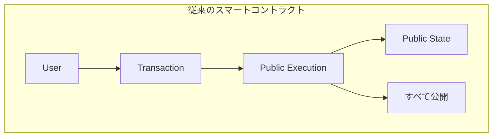
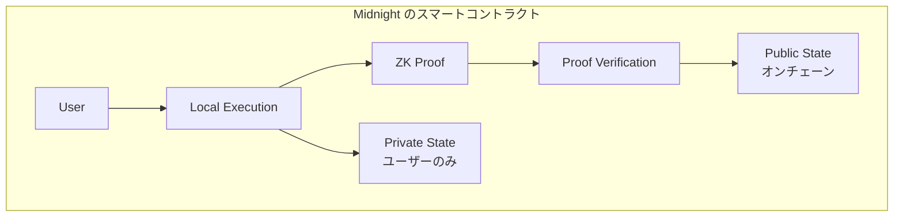
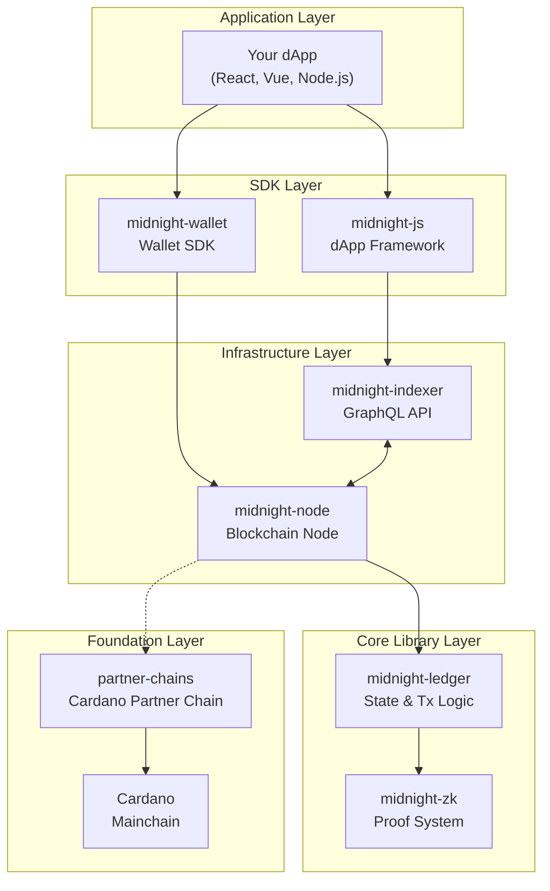

# Midnight 開発者ガイド - はじめに

> **対象読者**: EVM/Solana などでの開発経験があり、Midnight の技術的詳細を理解したい開発者

## Midnight とは何か

Midnight は **プライバシー保護スマートコントラクト** を実現するブロックチェーンプラットフォームです。Cardano をメインチェーン（L1）とする **Partner Chain** として動作し、ゼロ知識証明（ZK）を用いてプライバシーと透明性のバランスを取ります。

### コアバリュー

| 特徴 | 説明 |
|------|------|
| **プライバシー保護** | ゼロ知識証明により、トランザクションの正当性を証明しながら機密データを秘匿 |
| **選択的開示** | 必要に応じて監査や規制当局への情報開示が可能 |
| **Cardano 連携** | Cardano のセキュリティと相互運用性を活用 |
| **TypeScript 中心** | フロントエンド開発者にも親しみやすい開発体験 |

## EVM/Solana との根本的な違い

### 実行モデルの比較

| 観点 | EVM (Ethereum) | Solana | Midnight |
|------|----------------|--------|----------|
| 実行場所 | オンチェーン | オンチェーン | ローカル + オンチェーン検証 |
| 状態の可視性 | すべて公開 | すべて公開 | 公開 + プライベート |
| 証明方式 | なし（直接実行） | なし（直接実行） | ゼロ知識証明 |
| トランザクション内容 | 全公開 | 全公開 | 暗号化可能 |
| コントラクト言語 | Solidity/Vyper | Rust/Anchor | Compact |

## なぜ Midnight を選ぶのか

### ユースケース例

1. **プライベートトークン移転**
   - 送金額・送受信者を秘匿しながら残高証明
   - 監査時のみ選択的に開示

2. **機密データを扱う DeFi**
   - ポートフォリオ情報を隠しながら担保証明
   - 信用スコアを公開せずに資格証明

3. **プライバシー重視の DAO**
   - 匿名投票と投票結果の正当性証明
   - メンバーシップの秘匿

4. **コンプライアンス対応**
   - KYC/AML 準拠を証明しながらユーザーデータを保護
   - 規制当局への選択的開示

## 技術スタックの概要

Midnight は以下のコンポーネントで構成されています：

## ドキュメント構成

このガイドブックは以下の章で構成されています：

| 章 | 内容 |
|----|------|
| [01-architecture](./01-architecture.md) | アーキテクチャ全体像とコンポーネント関係 |
| [02-core-concepts](./02-core-concepts.md) | ゼロ知識証明、Zswap、状態管理の詳細 |
| [03-compact-language](./03-compact-language.md) | Compact 言語によるスマートコントラクト開発 |
| [04-sdk-development](./04-sdk-development.md) | midnight-js と wallet SDK を使った dApp 開発 |
| [05-infrastructure](./05-infrastructure.md) | Node と Indexer の運用・接続 |
| [06-comparison](./06-comparison.md) | EVM/Solana との詳細比較 |
| [07-resources](./07-resources.md) | リソース・次のステップ |

## 前提知識

このガイドを読むにあたり、以下の知識があると理解が深まります：

- **必須**: スマートコントラクト開発経験（EVM または Solana）
- **推奨**: TypeScript/JavaScript
- **あると良い**: 暗号学の基礎概念（ハッシュ、公開鍵暗号）

ゼロ知識証明や Cardano の事前知識は不要です。本ガイドで必要な概念を解説します。

---

**次章**: [01-architecture](./01-architecture.md) - アーキテクチャ全体像

