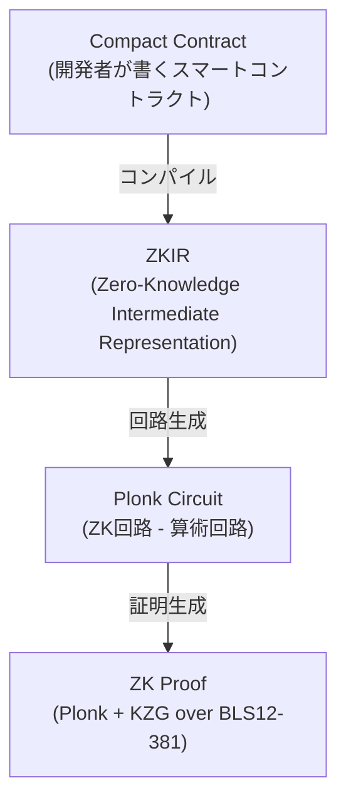
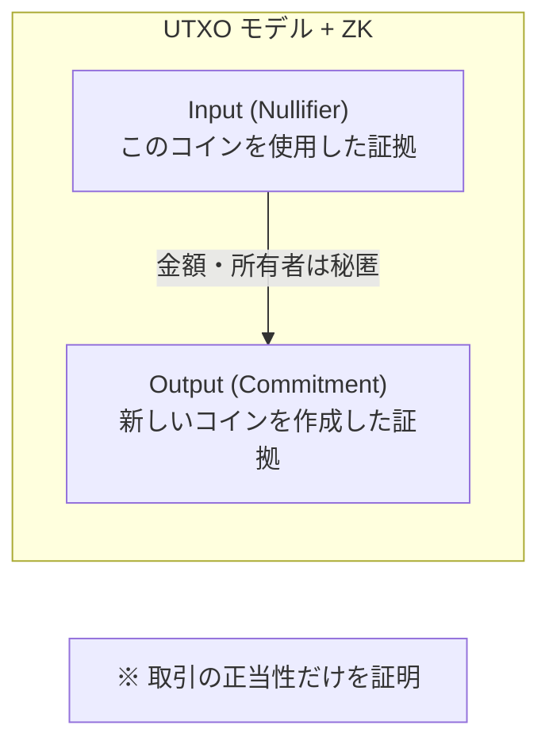
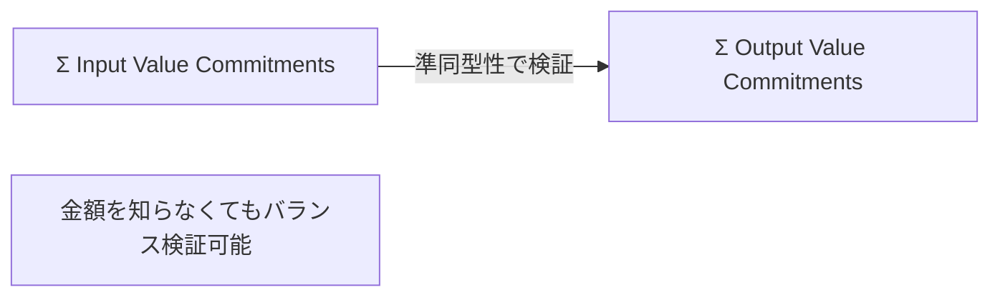
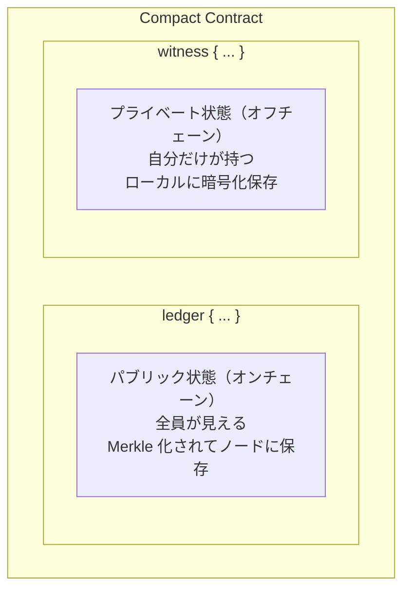
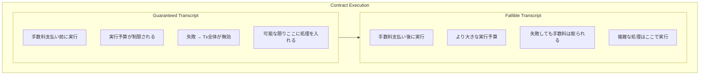
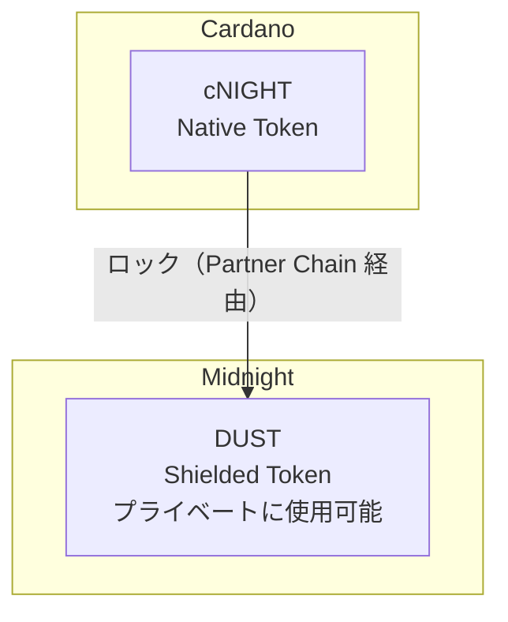
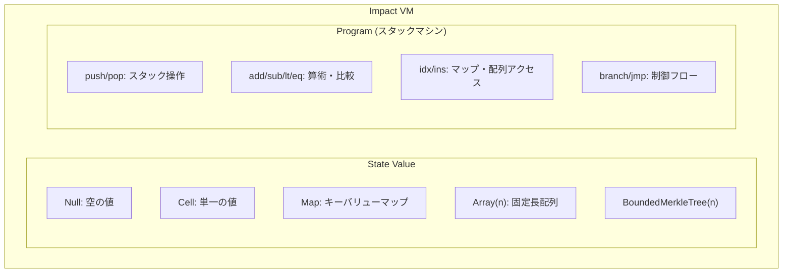
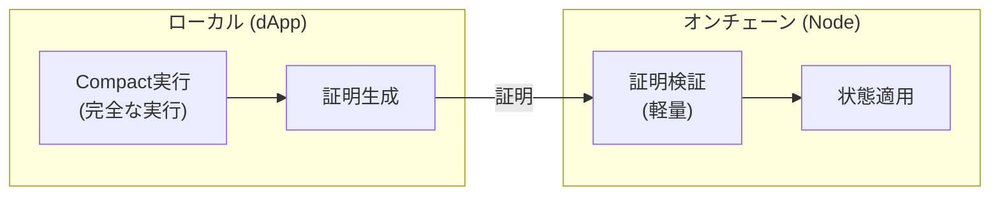

# コア概念: ゼロ知識証明と状態管理

この章では、Midnight の技術的な核となる概念を解説します。EVM/Solana 開発者が最も戸惑う部分であり、かつ Midnight の強みでもあります。

## ゼロ知識証明 (ZKP) 基礎

### なぜゼロ知識証明が必要か

従来のブロックチェーンでは、トランザクションの検証にはすべてのデータを公開する必要がありました。

```
従来のブロックチェーン:
    "Alice が Bob に 100 ETH を送る"
    → すべてのノードが確認できる
    → すべての人が知ることができる
```

ゼロ知識証明は「**何かを証明しながら、その証明に必要なデータ以上のことを明かさない**」技術です。

```
Midnight:
    "有効なトランザクションである" という証明
    → ノードは正当性を検証できる
    → しかし、金額や当事者を知ることはできない
```

### Midnight の ZK スタック



### 証明システムの詳細

| 要素 | Midnight での実装 | 説明 |
|------|-------------------|------|
| 証明システム | Plonk | ユニバーサルで効率的な SNARK |
| コミットメント | KZG | 多項式コミットメント |
| 楕円曲線 | BLS12-381 | ペアリング対応曲線 |
| 埋め込み曲線 | JubJub | BLS12-381 上の効率的な曲線 |

**開発者が知っておくべきこと:**
- 証明生成は計算コストが高い（数秒〜数十秒）
- 証明検証は高速（ミリ秒オーダー）
- Trusted Setup が必要（Midnight では実施済み）

## Zswap: シールドトークン

### Zswap の概念

Zswap は Midnight のシールド（秘匿）トークン実装です。Zerocash にアトミックスワップを追加したものと考えてください。



### Commitment と Nullifier

**Commitment（コミットメント）:**
- コインの「存在証明」
- `Hash(CoinInfo, PublicKey)` で計算
- オンチェーンの Merkle Tree に格納
- コインの内容を秘匿しながら、存在を証明

**Nullifier（ナリファイア）:**
- コインの「使用証明」
- `Hash(CoinInfo, SecretKey)` で計算
- 二重使用を防止
- 同じコインから同じ Nullifier が必ず生成される

```rust
// 概念的な構造（実際の Rust コード）
struct CoinInfo {
    value: u128,        // 金額
    type_: RawTokenType, // トークン種別
    nonce: [u8; 32],    // ランダム値
}

type CoinCommitment = Hash<(CoinInfo, ZswapCoinPublicKey)>;
type CoinNullifier = Hash<(CoinInfo, ZswapCoinSecretKey)>;
```

### Zswap の状態

```rust
struct ZswapState {
    // コミットメントの Merkle Tree
    commitment_tree: MerkleTree<CoinCommitment>,
    
    // 重複防止用のコミットメントセット
    commitment_set: Set<CoinCommitment>,
    
    // 使用済みコインの Nullifier セット
    nullifiers: Set<CoinNullifier>,
    
    // 過去の Merkle Root 履歴（有効期限付き）
    commitment_tree_history: TimeFilterMap<MerkleTreeRoot>,
}
```

### トランザクションフロー

**1. Input（コインを使う）**

| 区分 | 内容 |
|------|------|
| **証明内容** | Merkle Tree に自分のコミットメントが含まれている / 正しい Nullifier を計算 / Value Commitment が正しい |
| **公開情報** | Merkle Tree Root / Nullifier / Value Commitment |
| **秘匿情報** | 金額、トークン種別、所有者 |

**2. Output（コインを作る）**

| 区分 | 内容 |
|------|------|
| **証明内容** | コミットメントが正しく計算されている / Value Commitment が正しい |
| **公開情報** | Commitment / Value Commitment / 暗号化された受取人情報 (オプション) |
| **秘匿情報** | 金額、トークン種別、受取人 |

**3. Balance Check（バランス検証）**



## 状態の二重構造

Midnight の最も特徴的な概念は「**パブリック状態とプライベート状態の分離**」です。

### 状態モデル



### Compact での表現

```compact
// counter.compact の例

pragma midnight 0.3.0;

// パブリック状態: オンチェーン、誰でも読める
ledger {
    total_count: Unsigned Integer;
    public_message: Bytes;
}

// プライベート状態は witness 関数内で暗黙的に扱う
// 例: ユーザーごとの残高、投票内容など

export circuit increment(
    // witness はプライベートな計算
    // ここでプライベート状態を読み書きできる
): [] {
    ledger.total_count = ledger.total_count + 1;
}
```

### EVM との比較

| 観点 | EVM | Midnight |
|------|-----|----------|
| 状態の種類 | パブリックのみ | パブリック + プライベート |
| 状態の保存場所 | オンチェーン | オンチェーン + ローカル |
| 状態の可視性 | 全て公開 | 選択的開示 |
| 実行の検証 | 再実行 | ZK 証明 |

## コントラクトの呼び出しと Effects

### コントラクト呼び出しの構造

```rust
struct ContractCall {
    address: ContractAddress,          // コントラクトアドレス
    entry_point: Bytes,                 // 呼び出す関数
    guaranteed_transcript: Transcript,  // 必ず実行される部分
    fallible_transcript: Transcript,    // 失敗する可能性がある部分
    communication_commitment: Fr,       // 入出力へのコミットメント
    proof: Proof,                       // ZK 証明
}
```

### Guaranteed vs Fallible Transcript



### Effects: コントラクトの副作用

コントラクトは Zswap や他のコントラクトと相互作用できます：

```rust
struct Effects {
    // Zswap との相互作用
    claimed_nullifiers: Set<CoinNullifier>,      // 使用するコイン
    claimed_shielded_receives: Set<CoinCommitment>, // 受け取るコイン
    shielded_mints: Map<TokenType, u64>,         // シールドトークン発行
    
    // 他のコントラクト呼び出し
    claimed_contract_calls: Set<ContractCallClaim>,
    
    // アンシールドトークン操作
    unshielded_inputs: Map<TokenType, u128>,
    unshielded_outputs: Map<TokenType, u128>,
}
```

## トークンの種類

### DUST と Night

| トークン | 形態 | 用途 |
|----------|------|------|
| DUST | シールド（秘匿） | プライベートな価値転送 |
| Night | アンシールド（公開） | ガス代、公開取引 |

### cNIGHT: Cardano からのブリッジ



## オンチェーン実行: Impact VM

### Impact VM の概要

Midnight のオンチェーン仮想マシン（Impact VM）は、コントラクトの状態遷移を実行します。



### ローカル実行とオンチェーン検証

開発者が理解すべき重要なポイント：

1. **ローカル実行**: dApp が Compact コントラクトを実行し、結果と ZK 証明を生成
2. **オンチェーン検証**: ノードは ZK 証明を検証し、状態遷移を適用



---

**次章**: [03-compact-language](./03-compact-language.md) - Compact 言語ガイド

