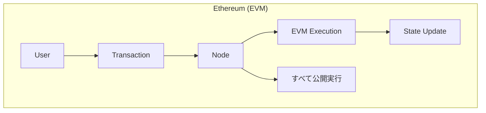
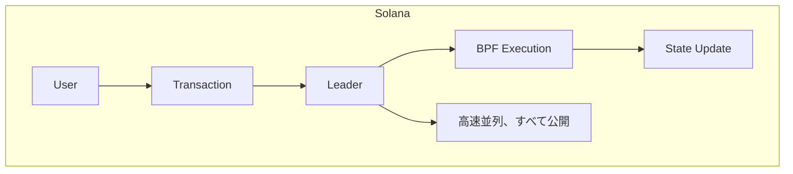
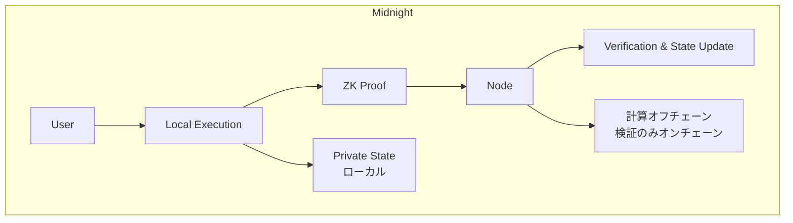

# EVM/Solana 開発者向け比較ガイド

この章では、EVM（Ethereum）や Solana での開発経験を持つ方向けに、Midnight との詳細な比較を提供します。

## アーキテクチャ比較







## 主要概念の対応表

### 状態管理

| 概念 | Ethereum | Solana | Midnight |
|------|----------|--------|----------|
| パブリック状態 | Storage (contract) | Account Data | `ledger { ... }` |
| プライベート状態 | なし | なし | `witness` + ローカルストレージ |
| 状態の可視性 | 全公開 | 全公開 | 選択的 |
| 状態モデル | Account-based | Account-based | Hybrid (Account + UTXO) |

### スマートコントラクト

| 観点 | Ethereum | Solana | Midnight |
|------|----------|--------|----------|
| 言語 | Solidity, Vyper | Rust (Anchor) | Compact |
| 実行環境 | EVM | BPF/SBF | Impact VM + ZK Circuit |
| 実行場所 | オンチェーン | オンチェーン | オフチェーン + オンチェーン検証 |
| ガス/手数料 | Gas (ETH) | Compute Units (SOL) | DUST |
| デプロイコスト | 中〜高 | 低 | 中（ZKキー含む） |

### トークン

| 観点 | Ethereum | Solana | Midnight |
|------|----------|--------|----------|
| ネイティブ通貨 | ETH | SOL | DUST (シールド) / Night (アンシールド) |
| トークン規格 | ERC-20, ERC-721 | SPL Token | Zswap トークン |
| プライバシー | なし（Tornado Cash等が必要） | なし | ネイティブサポート |
| 移転の可視性 | 全公開 | 全公開 | 暗号化可能 |

## コード比較

### 基本的なカウンター

**Solidity (Ethereum):**
```solidity
// SPDX-License-Identifier: MIT
pragma solidity ^0.8.0;

contract Counter {
    uint256 public count;
    
    function increment() public {
        count += 1;
    }
    
    function decrement() public {
        require(count > 0, "Count is zero");
        count -= 1;
    }
    
    function getCount() public view returns (uint256) {
        return count;
    }
}
```

**Rust/Anchor (Solana):**
```rust
use anchor_lang::prelude::*;

declare_id!("Counter111111111111111111111111111111111111");

#[program]
pub mod counter {
    use super::*;
    
    pub fn increment(ctx: Context<Increment>) -> Result<()> {
        ctx.accounts.counter.count += 1;
        Ok(())
    }
    
    pub fn decrement(ctx: Context<Decrement>) -> Result<()> {
        require!(ctx.accounts.counter.count > 0, CounterError::CountIsZero);
        ctx.accounts.counter.count -= 1;
        Ok(())
    }
}

#[account]
pub struct CounterAccount {
    pub count: u64,
}
```

**Compact (Midnight):**
```compact
pragma midnight 0.3.0;

ledger {
    count: Unsigned Integer;
}

export circuit increment(): [] {
    ledger.count = ledger.count + 1;
}

export circuit decrement(): [] {
    assert ledger.count > 0;
    ledger.count = ledger.count - 1;
}

export circuit get_count(): Unsigned Integer {
    return ledger.count;
}
```

### プライベート残高のあるトークン

**Ethereum: プライバシーなし**
```solidity
contract Token {
    mapping(address => uint256) public balances;  // すべて公開
    
    function transfer(address to, uint256 amount) public {
        // 誰でも残高と転送を見ることができる
        balances[msg.sender] -= amount;
        balances[to] += amount;
    }
}
```

**Midnight: プライバシー付き**
```compact
pragma midnight 0.3.0;

ledger {
    // 総供給量のみ公開
    total_supply: Unsigned Integer;
    // 残高はプライベートに管理
}

witness get_my_balance(): Unsigned Integer;
witness update_balance(delta: Integer): [];
witness get_recipient_key(): Bytes;

export circuit transfer(amount: Unsigned Integer): [] {
    // プライベートに残高を確認
    let my_balance = get_my_balance();
    assert my_balance >= amount;
    
    // 残高を更新（プライベート）
    update_balance(-amount as Integer);
    
    // 受取人への転送（Zswap 経由、詳細は秘匿）
    // Effects で Zswap output を宣言
}
```

### アクセス制御

**Solidity:**
```solidity
contract Owned {
    address public owner;
    
    modifier onlyOwner() {
        require(msg.sender == owner, "Not owner");
        _;
    }
    
    function adminFunction() public onlyOwner {
        // 管理者のみ
    }
}
```

**Compact:**
```compact
ledger {
    owner_hash: Bytes;  // オーナーの公開鍵ハッシュ
}

witness get_caller_hash(): Bytes;

circuit check_owner(): [] {
    let caller = get_caller_hash();
    assert caller == ledger.owner_hash;
}

export circuit admin_function(): [] {
    check_owner();
    // 管理者のみの処理
}
```

## 開発フロー比較

### Ethereum 開発フロー

```
1. Solidity でコントラクト作成
2. Hardhat/Foundry でコンパイル
3. テストネットにデプロイ
4. ethers.js/viem でフロントエンド連携
5. MetaMask 等でトランザクション署名
```

### Solana 開発フロー

```
1. Rust/Anchor でプログラム作成
2. anchor build でコンパイル
3. テストネットにデプロイ
4. @solana/web3.js でフロントエンド連携
5. Phantom 等でトランザクション署名
```

### Midnight 開発フロー

```
1. Compact でコントラクト作成
2. compact compile でコンパイル (→ JS, 型定義, ZKキー)
3. TypeScript で witness 実装
4. midnight-js でフロントエンド連携
5. ZK 証明生成 + Midnight Wallet で署名
6. テストネット/ローカルにデプロイ
```

## 機能比較表

### トランザクション

| 機能 | Ethereum | Solana | Midnight |
|------|----------|--------|----------|
| 確認時間 | ~12秒 | ~400ms | ~6秒 |
| ファイナリティ | 確率的 (~12分) | 確率的 (~20秒) | 決定的 (GRANDPA) |
| 最大 TPS | ~15-30 | ~65,000 | 開発中 |
| 手数料モデル | オークション | 固定 + 優先料金 | 固定 |

### プライバシー

| 機能 | Ethereum | Solana | Midnight |
|------|----------|--------|----------|
| トランザクション内容 | 全公開 | 全公開 | 暗号化可能 |
| 残高 | 全公開 | 全公開 | 秘匿可能 |
| 送受信者 | 全公開 | 全公開 | 秘匿可能 |
| コントラクト状態 | 全公開 | 全公開 | 選択的開示 |
| ZK 証明 | 別途実装必要 | 別途実装必要 | ネイティブ |

### 開発体験

| 観点 | Ethereum | Solana | Midnight |
|------|----------|--------|----------|
| 学習曲線 | 低〜中 | 中〜高 | 中 |
| ツール成熟度 | 非常に高い | 高い | 発展中 |
| ドキュメント | 豊富 | 豊富 | 増加中 |
| コミュニティ | 最大 | 大 | 成長中 |
| TypeScript サポート | 良好 | 良好 | 非常に良好 |

## 移行パターン

### Ethereum → Midnight

| Ethereum パターン | Midnight 対応 |
|------------------|--------------|
| `msg.sender` | `witness` で caller 情報取得 |
| `require(condition)` | `assert condition` |
| `modifier` | 共通ロジックを circuit に分離 |
| `event Log(...)` | `log(...)` 関数 |
| `payable` | Zswap Effects |
| `mapping(address => uint)` | `Map<Bytes, Unsigned Integer>` |
| `ERC-20 transfer` | Zswap + witness |
| `Ownable` | `ledger.owner` + witness 検証 |

### Solana → Midnight

| Solana パターン | Midnight 対応 |
|----------------|--------------|
| `#[account]` | `ledger { ... }` |
| Program ID | Contract Address |
| PDAs | Contract-owned state |
| `require!` | `assert` |
| CPI (Cross-Program Invocation) | 別コントラクト呼び出し |
| SPL Token | Zswap トークン |
| Anchor Events | `log(...)` |

## よくある誤解と注意点

### 1. 「すべてがプライベート」ではない

```compact
// パブリック状態 = 誰でも読める
ledger {
    public_counter: Unsigned Integer;  // 公開
}

// プライベート = witness + ローカルストレージ
witness get_private_data(): Bytes;  // 本人のみ
```

### 2. 証明生成のコスト

```
Ethereum:   tx 送信 ──→ ~0.1秒
Solana:     tx 送信 ──→ ~0.1秒
Midnight:   証明生成 ──→ tx 送信 ──→ 数秒〜数十秒
               │
               └─ この時間が追加でかかる
```

### 3. オフチェーン計算の意味

```
EVM:     すべてのノードが同じ計算を実行
Midnight: 1人が計算 → 全員が証明を検証
          ↓
          計算の正当性は保証される
          計算の中身は秘匿される
```

### 4. 状態サイズの違い

```
Ethereum: 各トランザクションのデータがそのまま保存
Midnight: 証明のサイズは入力サイズに関係なく固定
          ↓
          大量のプライベートデータを扱っても証明は小さい
```

## パフォーマンス考慮事項

### 証明生成時間の目安

| 複雑さ | 証明生成時間 |
|--------|-------------|
| 単純な状態更新 | 2-5秒 |
| 中程度の計算 | 5-15秒 |
| 複雑なロジック | 15-60秒 |

### 最適化のヒント

1. **回路サイズの最小化**
   - ループの展開を避ける
   - 不要な計算を削除
   - バッチ処理を分割

2. **キャッシング**
   - 証明キーの事前ロード
   - 頻繁に使うデータのローカルキャッシュ

3. **並列化**
   - 複数の独立した証明を並列生成
   - Proof Server のスケーリング

## いつ Midnight を選ぶべきか

### Midnight が適している場合

- ✅ プライバシーが必須要件
- ✅ 規制対応で選択的開示が必要
- ✅ 機密データを扱う DeFi
- ✅ プライベート投票・ガバナンス
- ✅ 個人情報を扱うアプリケーション

### 他のチェーンが適している場合

- ⚠️ 超高頻度取引（HFT）→ Solana
- ⚠️ 最大の流動性が必要 → Ethereum
- ⚠️ 完全な透明性が必要 → EVM チェーン
- ⚠️ 最小レイテンシが必須 → Solana

---

**次章**: [07-resources](./07-resources.md) - リソースと次のステップ

