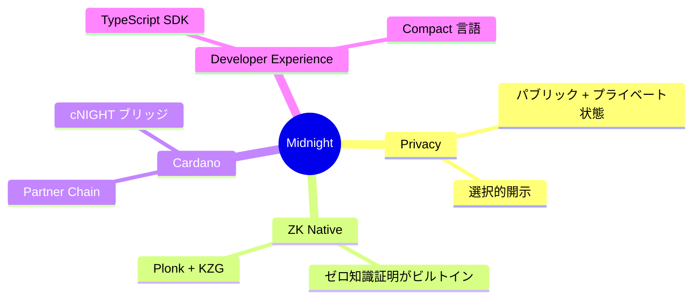

# Midnight 開発者ガイドブック

EVM/Solana 経験者向けの Midnight ブロックチェーン技術ガイドです。

## 対象読者

- EVM (Ethereum)、Solana など他ブロックチェーンでの開発経験がある
- Cardano 開発経験はない
- Midnight の技術的詳細を理解し、dApp 開発を行いたい

## 目次

| 章 | タイトル | 内容 |
|----|----------|------|
| [00](./ja/00-introduction.md) | **はじめに** | Midnight の概要、EVM/Solana との違い、なぜ選ぶべきか |
| [01](./ja/01-architecture.md) | **アーキテクチャ** | システム全体像、コンポーネント関係、データフロー |
| [02](./ja/02-core-concepts.md) | **コア概念** | ゼロ知識証明、Zswap、状態管理の詳細 |
| [03](./ja/03-compact-language.md) | **Compact 言語** | スマートコントラクト言語の完全ガイド |
| [04](./ja/04-sdk-development.md) | **SDK 開発** | midnight-js、ウォレット連携、React 統合 |
| [05](./ja/05-infrastructure.md) | **インフラ** | Node、Indexer の設定・運用 |
| [06](./ja/06-comparison.md) | **比較ガイド** | EVM/Solana との詳細比較、移行パターン |
| [07](./ja/07-resources.md) | **リソース** | 公式リソース、学習ロードマップ |

## クイックスタート

```bash
# 1. サンプルプロジェクトをクローン
git clone https://github.com/midnightntwrk/example-counter
cd example-counter

# 2. 依存関係をインストール
pnpm install

# 3. ローカル環境を起動
docker-compose up -d

# 4. ビルドして実行
pnpm build
pnpm start
```

## Midnight のハイライト



## 関連リポジトリ

このガイドブックは以下のリポジトリを参照しています：

- [midnight-node](../submodules/midnight-node/) - ブロックチェーンノード
- [midnight-ledger](../submodules/midnight-ledger/) - 台帳実装
- [midnight-zk](../submodules/midnight-zk/) - ZK 証明システム
- [midnight-indexer](../submodules/midnight-indexer/) - インデクサー
- [midnight-wallet](../submodules/midnight-wallet/) - ウォレット SDK
- [midnight-js](../submodules/midnight-js/) - dApp フレームワーク
- [partner-chains](../submodules/partner-chains/) - Cardano Partner Chain

## 貢献

フィードバックや改善提案は歓迎します：

1. Issue を作成
2. Pull Request を送信
3. ドキュメントの誤りを報告

## ライセンス

このドキュメントは Midnight のオープンソースリポジトリに基づいて作成されています。

