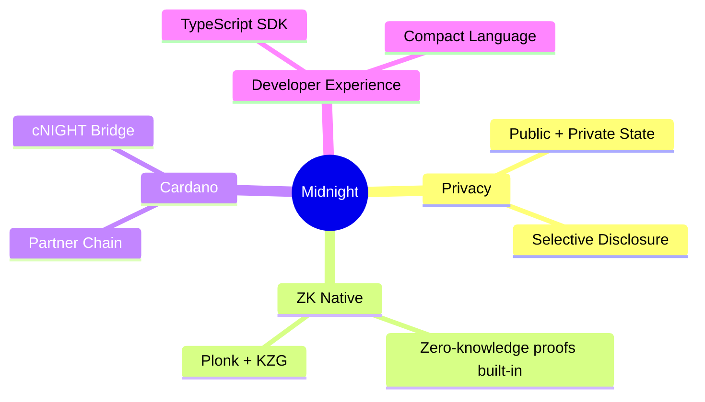

# Midnight Developer Guidebook

A technical guide for the Midnight blockchain, designed for developers with experience in EVM/Solana.

## Target Audience

- Have development experience with other blockchains like EVM (Ethereum) or Solana
- Do not have Cardano development experience
- Want to understand Midnight's technical details and develop dApps

## Table of Contents

| Chapter | Title | Content |
|---------|-------|---------|
| [00](./en/00-introduction.md) | **Introduction** | Midnight overview, differences from EVM/Solana, why choose it |
| [01](./en/01-architecture.md) | **Architecture** | System overview, component relationships, data flow |
| [02](./en/02-core-concepts.md) | **Core Concepts** | Zero-knowledge proofs, Zswap, state management details |
| [03](./en/03-compact-language.md) | **Compact Language** | Complete guide to smart contract language |
| [04](./en/04-sdk-development.md) | **SDK Development** | midnight-js, wallet integration, React integration |
| [05](./en/05-infrastructure.md) | **Infrastructure** | Node and Indexer setup and operations |
| [06](./en/06-comparison.md) | **Comparison Guide** | Detailed comparison with EVM/Solana, migration patterns |
| [07](./en/07-resources.md) | **Resources** | Official resources, learning roadmap |

## Quick Start

```bash
# 1. Clone sample project
git clone https://github.com/midnightntwrk/example-counter
cd example-counter

# 2. Install dependencies
pnpm install

# 3. Start local environment
docker-compose up -d

# 4. Build and run
pnpm build
pnpm start
```

## Midnight Highlights



## Related Repositories

This guidebook references the following repositories:

- [midnight-node](../submodules/midnight-node/) - Blockchain node
- [midnight-ledger](../submodules/midnight-ledger/) - Ledger implementation
- [midnight-zk](../submodules/midnight-zk/) - ZK proof system
- [midnight-indexer](../submodules/midnight-indexer/) - Indexer
- [midnight-wallet](../submodules/midnight-wallet/) - Wallet SDK
- [midnight-js](../submodules/midnight-js/) - dApp framework
- [partner-chains](../submodules/partner-chains/) - Cardano Partner Chain

## Contributing

Feedback and improvement suggestions are welcome:

1. Create an Issue
2. Submit a Pull Request
3. Report documentation errors

## License

This documentation is based on Midnight's open source repositories.

