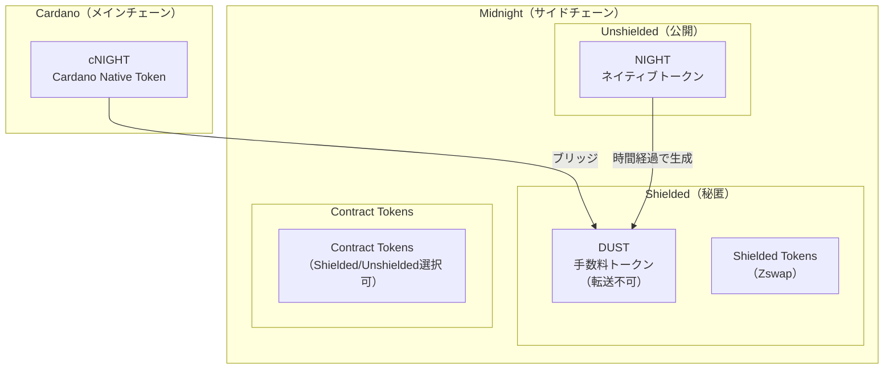
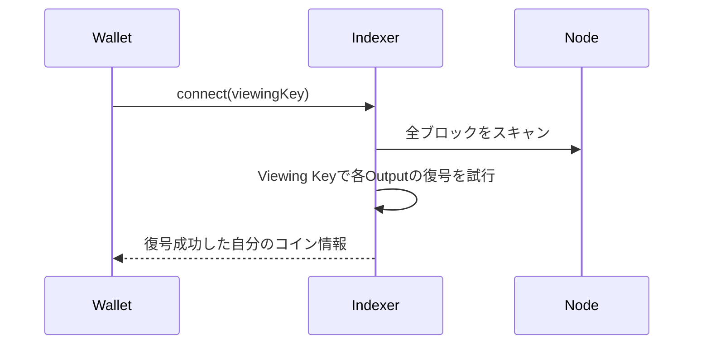
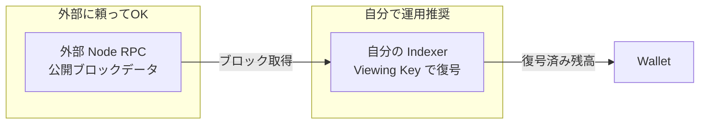

# トークンエコノミクス: NIGHT, DUST, Shielded の深掘り

この文書は Midnight のトークン設計について、技術的な詳細とプライバシーの現実を整理したものです。

## 目次

1. [トークンの種類](#トークンの種類)
2. [NIGHTとDUSTの関係](#nightとdustの関係)
3. [ShieldedとUnshieldedの違い](#shieldedとunshieldedの違い)
4. [Indexerの役割とプライバシー](#indexerの役割とプライバシー)
5. [プライバシーモデルの現実](#プライバシーモデルの現実)
6. [ガス代予測可能性の評価](#ガス代予測可能性の評価)

---

## トークンの種類

### 全体構造



### トークン比較表

| トークン | 種別 | プライバシー | 用途 | Indexer必要？ |
|---------|------|-------------|------|--------------|
| **NIGHT** | Unshielded Ledger | 公開 | 価値保存、DUST生成源 | 不要 |
| **DUST** | Shielded（特殊） | 秘匿 | 手数料支払い専用 | 必要 |
| **cNIGHT** | Cardano Native | 公開 | Cardano側でのNIGHT表現 | - |
| **Shielded Token** | Shielded Ledger | 秘匿 | プライベート送金 | 必要 |
| **Contract Token** | Contract | 選択可 | dApp用カスタムトークン | 設計次第 |

### コードでの定義

```rust
// NIGHT は UnshieldedTokenType として定義
pub const NIGHT: UnshieldedTokenType = UnshieldedTokenType(HashOutput([0u8; 32]));

// トークンタイプの列挙
pub enum TokenType {
    Unshielded(UnshieldedTokenType),  // NIGHT等
    Shielded(ShieldedTokenType),       // Zswap tokens
    Dust,                              // 手数料専用
}
```

---

## NIGHTとDUSTの関係

### DUST生成メカニズム

NIGHTを保有すると、時間経過でDUSTが自動生成されます。

```
DUST量
  ↑
  │    ┌────────────────────────── MAX (5 DUST / 1 NIGHT)
  │   /
  │  /  線形増加
  │ /   （約1週間でMAX到達）
  │/
  └──────────────────────────────────────────► 時間
  0   Day 1   Day 2   Day 3  ...  Day 7
```

### パラメータ

```rust
const INITIAL_DUST_PARAMETERS: DustParameters = {
    night_dust_ratio: 5_000_000_000,    // 1 NIGHT → 最大 5 DUST
    generation_decay_rate: 8_267,        // 約1週間で上限到達
    dust_grace_period: Duration::from_hours(3),
};
```

| パラメータ | 値 | 意味 |
|-----------|-----|------|
| DUST上限 | 5 DUST / 1 NIGHT | 最大生成量 |
| 生成時間 | 約1週間 | 0→上限までの時間 |
| 減衰時間 | 約1週間 | 上限→0までの時間 |

### DUST残高は「保存されない」

DUSTの残高はオンチェーンに保存されず、**使用時に計算**されます：

```rust
fn updated_value(dust: DustOutput, gen: DustGenerationInfo, now: Timestamp, params: DustParameters) -> u128 {
    // 経過時間から現在のDUST量を計算
    let elapsed = now - dust.ctime;
    let generated = elapsed.as_seconds() * rate + dust.initial_value;
    clamp(generated, 0, max_dust)
}
```

### NIGHTを送金するとDUSTはリセット

```
Day 0:  Alice: 100 NIGHT受取、DUST生成開始
Day 7:  Alice: DUST = 500 (MAX)
Day 8:  Alice → Bob: 100 NIGHT送金
        Alice: NIGHT=0, DUST減衰開始
Day 9:  Bob → Alice: 100 NIGHT送金
        Alice: NIGHT=100 (新UTXO), DUST=0から再スタート ← リセット
Day 16: Alice: DUST = 500 に再到達
```

**重要**: NIGHT UTXOごとにDUST UTXOが紐付く。NIGHTを動かすと、新しいDUST UTXOが0から生成開始される。

### MAX到達後の補充

MAX到達後にDUSTを使っても、NIGHTを保有し続けていれば再びMAXに向かって生成される。

```
使用前: DUST 500
使用後: DUST 200 (300使った)
1週間後: DUST 500 に戻る ← 補充される
```

---

## ShieldedとUnshieldedの違い

### 残高確認方法の違い

| 種別 | 残高確認方法 | 外部から見えるか |
|------|-------------|-----------------|
| **Unshielded (NIGHT)** | アドレスでNodeに直接クエリ | 見える |
| **Shielded (DUST等)** | Viewing Keyで復号が必要 | 見えない |

### Unshielded (NIGHT) の残高確認

```rust
pub fn unshielded_utxos(&self, ledger_state: &LedgerState<D>) -> Vec<Utxo> {
    let address = self.unshielded.user_address;
    ledger_state.utxo.utxos
        .iter()
        .filter(|utxo| utxo.0.owner == address)  // アドレスでフィルタするだけ
        .map(|utxo| (*utxo.0).clone())
        .collect()
}
```

### Shielded の残高確認



### Viewing Key

```rust
/// Bech32m-encoded shielded encryption secret key, aka. "viewing key"
pub fn viewing_key(&self, network_id: &str) -> String {
    // encryption_secret_key を Bech32m エンコード
    bech32::encode::<Bech32m>(hrp, &data)
}
```

Viewing Key = 暗号化された出力データを**復号するための秘密鍵**

---

## Indexerの役割とプライバシー

### Indexerが必要な理由

| トークン | Indexer必要？ | 理由 |
|---------|-------------|------|
| NIGHT | 不要 | アドレスでNodeに直接クエリ可能 |
| DUST | 必要 | Viewing Keyで復号が必要 |
| Shielded Tokens | 必要 | Viewing Keyで復号が必要 |

### 運用パターンとプライバシー

```
プライバシーレベル（高→低）:

1. 自分でNode + Indexer運用
   → Viewing Keyを誰にも渡さない
   
2. 外部Node + 自分でIndexer運用
   → Viewing Keyは安全、ブロックデータは外部から取得
   
3. 外部Indexerに委任
   → Indexer運営者が残高・取引履歴を見れる
```

### 外部NodeでもOKな理由

Nodeから取得するのは**公開ブロックデータ**（Commitment、Nullifier、暗号化データ）であり、復号はIndexer側で行うため。



---

## プライバシーモデルの現実

### NIGHTからDUST残高は推測可能？

**部分的にYes**

| 情報 | 外部から見えるか |
|------|-----------------|
| NIGHT保有量 | ✓ 見える |
| DUST最大値 (NIGHT × 5) | ✓ 計算可能 |
| 実際のDUST残高 | ✗ 見えない |
| DUST使用履歴 | ✗ 見えない |

### NIGHTトランザクション時のプライバシー

**NIGHTを動かすと、Tx作成者がバレる**

```
NIGHT送金トランザクション:
┌────────────────────────────────────────┐
│  Input:  NIGHT UTXO (Alice, 100)  ← 公開 │
│  Output: NIGHT UTXO (Bob, 100)    ← 公開 │
│  Fee:    DUST (秘匿)              ← 意味なし │
└────────────────────────────────────────┘

観察者: 「AliceがNIGHTを送った」→「AliceがDUSTを使った」
```

### DUSTがShieldedな本当の価値

```
【NIGHT操作時】
DUSTのShielded性 → プライバシー価値なし（送信者バレる）

【Shielded操作時】
DUSTのShielded性 → プライバシー価値あり（送信者不明）
```

**DUSTをShieldedにする理由:**
1. Shielded操作時のTx作成者匿名性
2. トランザクション間のリンク不可能性
3. MEV対策（手数料支払いパターンを隠す）

### 正直な評価

```
┌──────────────────────────────────────────────────────────────┐
│  Midnightは「完全匿名」ではなく「選択的プライバシー」        │
├──────────────────────────────────────────────────────────────┤
│                                                              │
│  ・NIGHT使う = 透明な操作（送受信者・金額が公開）           │
│  ・Shielded使う = プライベートな操作                        │
│                                                              │
│  プライバシーが必要ならShielded操作を使う                   │
│  透明性が必要ならNIGHT/Unshieldedを使う                     │
│                                                              │
└──────────────────────────────────────────────────────────────┘
```

---

## ガス代予測可能性の評価

### NIGHTとDUSTを分ける理由

「ガス代の予測がしやすい」と言われるが、**完全な予測可能性ではない**。

### Ethereumとの比較

| 項目 | Ethereum | Midnight |
|------|----------|----------|
| ガス支払い手段 | ETH | DUST |
| 市場取引 | ETHは取引可能 | DUSTは取引不可 |
| ガス価格の決定 | 市場の需給（オークション） | 固定（Tx種類による） |
| 混雑時 | ガス価格高騰 | DUST量は変わらない |

### 予測可能なこと・不可能なこと

**予測可能:**
- 1 Txに必要なDUST量（固定）
- 1 NIGHTから得られるDUST量（5 DUST / 週）
- すでに持っているNIGHTからのDUST生成

**予測不可能:**
- NIGHTの市場価格
- 新たにNIGHTを買うコスト
- 「ドル換算」でのDUSTコスト

### 正直な評価

```
Q: NIGHTが上下するなら、間接的にDUSTも上下するのでは？

A: その通り。ドル換算のコストは変動する

ただし違いは：
1. 「いつ」変動するか
   ETH: 毎回のTx時
   NIGHT: 購入時のみ（その後は固定レート）

2. 混雑時の挙動
   ETH: ガス価格高騰（オークション）
   DUST: 量は変わらない

3. 事前確定
   ETH: 不可能（Tx直前まで分からない）
   NIGHT: 可能（買った時点で将来のDUST量が確定）

→ 「完全な予測可能性」ではなく「相対的な予測可能性」
```

### アナロジー

```
【Ethereum = タクシー】
・乗るたびに料金が変わる
・雨の日は高い（混雑時高騰）

【Midnight = 月額パス】
・パスを買う時の価格は変動する
・でもパスを持っていれば、乗り放題
・混雑時でも追加料金なし

→ パスの価格は変動するが、「パスを持っていれば乗り放題」は予測可能
```

---

## 参考リンク

- [midnight-ledger/spec/dust.md](https://github.com/midnightntwrk/midnight-ledger/blob/main/spec/dust.md)
- [midnight-ledger/spec/zswap.md](https://github.com/midnightntwrk/midnight-ledger/blob/main/spec/zswap.md)
- [midnight-ledger/spec/night.md](https://github.com/midnightntwrk/midnight-ledger/blob/main/spec/night.md)

