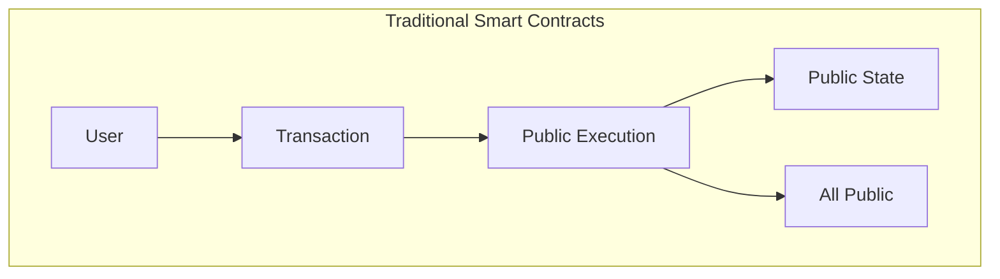
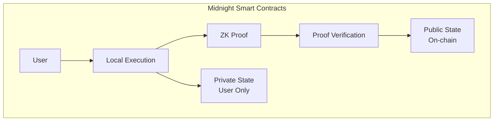
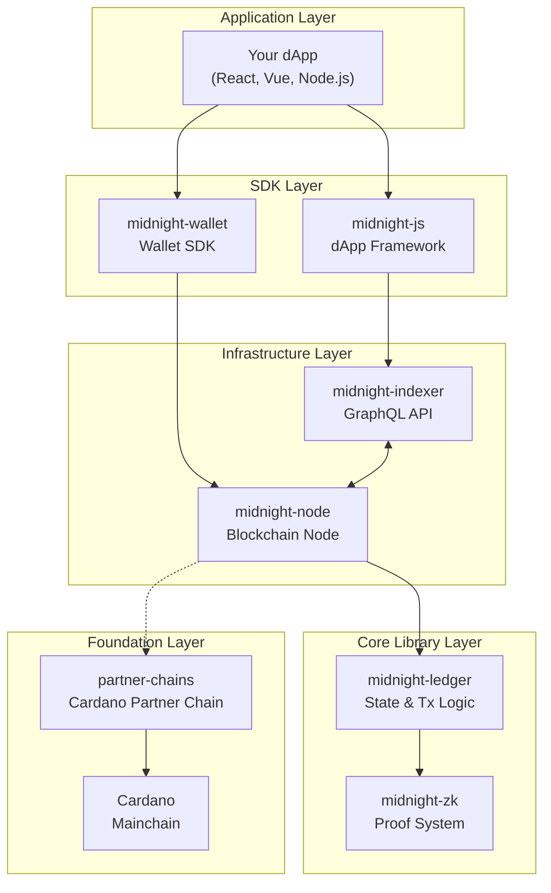

# Midnight Developer Guide - Introduction

> **Target Audience**: Developers with experience in EVM/Solana who want to understand Midnight's technical details

## What is Midnight

Midnight is a blockchain platform that enables **privacy-preserving smart contracts**. It operates as a **Partner Chain** with Cardano as the main chain (L1), balancing privacy and transparency using zero-knowledge proofs (ZK).

### Core Values

| Feature | Description |
|---------|-------------|
| **Privacy Protection** | Zero-knowledge proofs allow proving transaction validity while keeping confidential data secret |
| **Selective Disclosure** | Information can be disclosed to auditors or regulators when needed |
| **Cardano Integration** | Leverages Cardano's security and interoperability |
| **TypeScript-Centric** | Developer-friendly experience for frontend developers |

## Fundamental Differences from EVM/Solana

### Execution Model Comparison

| Aspect | EVM (Ethereum) | Solana | Midnight |
|--------|----------------|--------|----------|
| Execution Location | On-chain | On-chain | Local + On-chain verification |
| State Visibility | All public | All public | Public + Private |
| Proof Method | None (direct execution) | None (direct execution) | Zero-knowledge proof |
| Transaction Content | Fully public | Fully public | Can be encrypted |

## Why Choose Midnight

### Use Case Examples

1. **Private Token Transfer**
   - Hide transfer amount and parties while proving balance
   - Selective disclosure only during audits

2. **DeFi Handling Confidential Data**
   - Prove collateral while hiding portfolio information
   - Prove eligibility without revealing credit score

3. **Privacy-Focused DAO**
   - Anonymous voting with proof of vote validity
   - Hidden membership

4. **Compliance Support**
   - Prove KYC/AML compliance while protecting user data
   - Selective disclosure to regulators

## Technology Stack Overview

Midnight consists of the following components:

## Document Structure

This guidebook consists of the following chapters:

| Chapter | Content |
|---------|---------|
| [01-architecture](./01-architecture.md) | Overall architecture and component relationships |
| [02-core-concepts](./02-core-concepts.md) | Details on zero-knowledge proofs, Zswap, state management |
| [03-compact-language](./03-compact-language.md) | Smart contract development with Compact language |
| [04-sdk-development](./04-sdk-development.md) | dApp development with midnight-js and wallet SDK |
| [05-infrastructure](./05-infrastructure.md) | Node and Indexer operations and connections |
| [06-comparison](./06-comparison.md) | Detailed comparison with EVM/Solana |
| [07-resources](./07-resources.md) | Resources and next steps |

## Prerequisites

The following knowledge will help deepen your understanding:

- **Required**: Smart contract development experience (EVM or Solana)
- **Recommended**: TypeScript/JavaScript
- **Nice to have**: Basic cryptography concepts (hash, public key cryptography)

No prior knowledge of zero-knowledge proofs or Cardano is required. This guide explains all necessary concepts.

---

**Next Chapter**: [01-architecture](./01-architecture.md) - Overall Architecture

