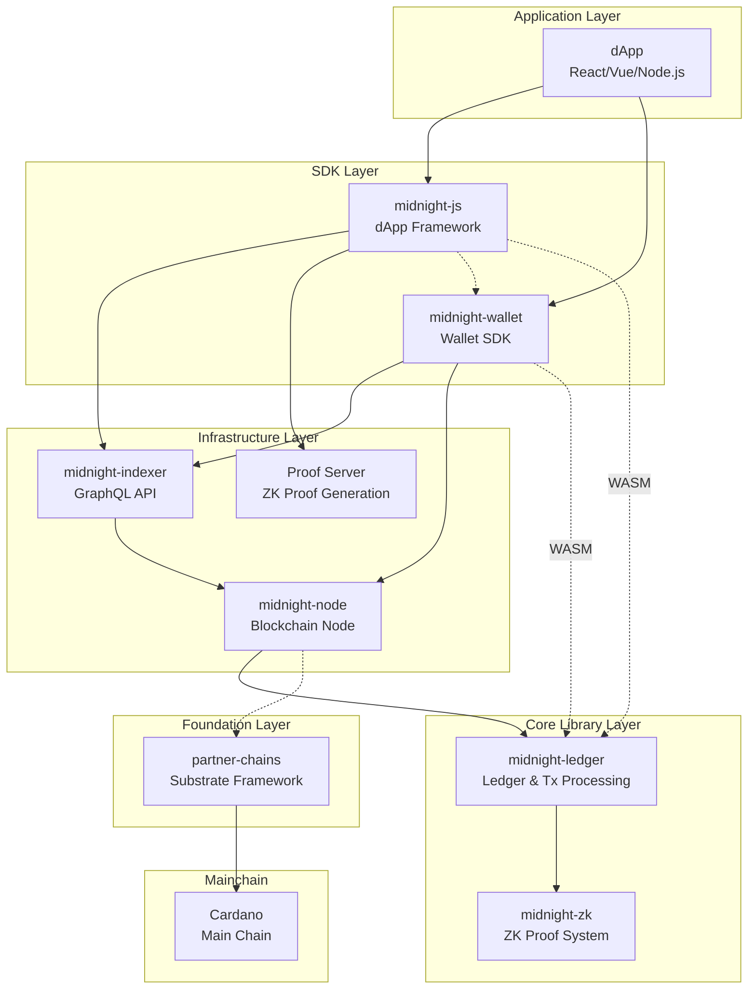
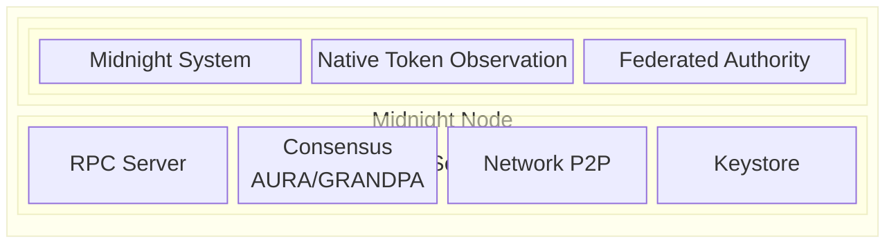
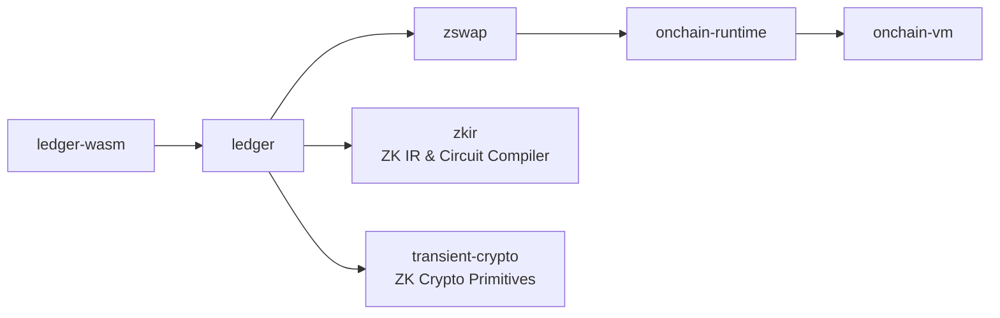
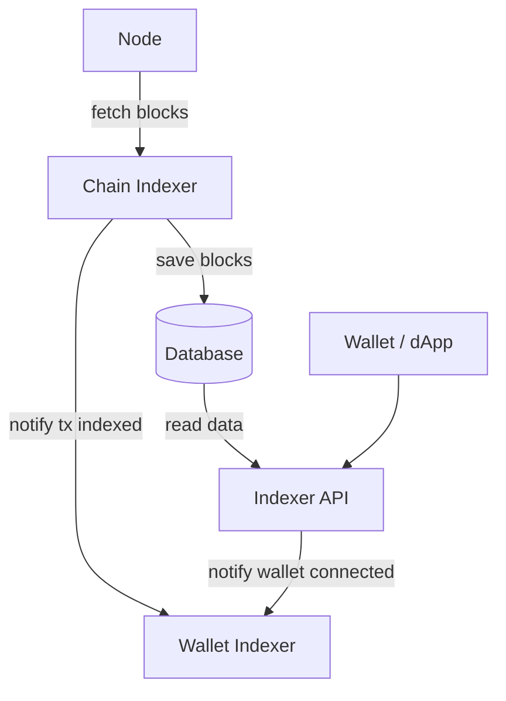
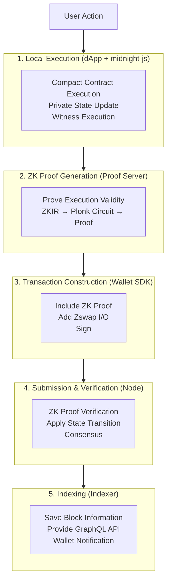

# Overall Architecture

Midnight is a system where multiple components work together. Understanding the role and relationships of each component makes design decisions easier during dApp development.

## System Overview

**Legend:**
- Solid line → Direct dependency/communication
- Dotted line → Library dependency (WASM bindings, etc.)

## Component Details

### midnight-node

**Role**: Core node implementation of the Midnight blockchain

| Item | Details |
|------|---------|
| Language | Rust |
| Base | Substrate (Polkadot SDK) |
| Consensus | AURA (block production) + GRANDPA (finality) |
| Block Time | 6 seconds |
| Ports | WebSocket RPC: 9944 / P2P: 30333 |

**Main Pallets:**
- `pallet-midnight`: Core transaction processing, ZK proof verification
- `pallet-midnight-system`: System transaction management
- `pallet-native-token-observation`: Cardano bridge (cNIGHT → DUST)
- `pallet-federated-authority`: Federated governance

---

### midnight-ledger

**Role**: Ledger implementation, transaction structure, state management

| Item | Details |
|------|---------|
| Language | Rust + WASM (TypeScript API) |
| Main Features | Transaction processing, ZK proof verification, contract runtime |

**Main Components:**
| Component | Role |
|-----------|------|
| `ledger` | Main transaction processing implementation |
| `zswap` | Shielded tokens (private transfer + atomic swap) |
| `zkir` | Zero-knowledge IR & circuit compiler |
| `onchain-runtime` | Contract runtime |
| `onchain-vm` | Impact VM (on-chain execution) |

---

### midnight-zk

**Role**: Zero-knowledge proof system and ZK circuit construction tools

| Item | Details |
|------|---------|
| Language | Rust |
| Proof System | Plonk + KZG commitment |
| Elliptic Curves | BLS12-381, JubJub |

**Main Components:**
| Component | Role |
|-----------|------|
| `curves` | BLS12-381 / JubJub elliptic curve implementation |
| `proof-system` | Plonk proof system (KZG-based) |
| `circuits` | ZK circuit construction toolkit |
| `aggregator` | Proof aggregation (efficient verification of multiple proofs) |

---

### midnight-indexer

**Role**: Blockchain data indexing and API provision

| Item | Details |
|------|---------|
| Language | Rust |
| API | GraphQL (Query + Subscription) |
| Storage | SQLite (standalone) / PostgreSQL (cloud) |

**Deployment Modes:**
- **Standalone**: Single binary + SQLite (development/small scale)
- **Cloud**: Distributed microservices + PostgreSQL + NATS (production)

---

### midnight-js

**Role**: TypeScript dApp development framework

| Item | Details |
|------|---------|
| Language | TypeScript |
| Similar to | Web3.js (Ethereum), polkadot.js (Polkadot) |

**Main Packages:**
| Package | Role |
|---------|------|
| `@midnight-ntwrk/midnight-js-contracts` | Contract operations |
| `@midnight-ntwrk/midnight-js-types` | Common type definitions |
| `@midnight-ntwrk/midnight-js-level-private-state-provider` | Private state persistence |
| `@midnight-ntwrk/midnight-js-http-client-proof-provider` | Proof server client |
| `@midnight-ntwrk/midnight-js-indexer-public-data-provider` | Indexer client |

**Distinctive Features (not in EVM):**
- Local smart contract execution
- Private state management and persistence
- Zero-knowledge proof generation and verification

---

### midnight-wallet

**Role**: Wallet SDK implementation

| Item | Details |
|------|---------|
| Language | TypeScript |
| Key Derivation | HD wallet (BIP-32 like) |
| Address Format | Bech32m |

**Main Packages:**
| Package | Role |
|---------|------|
| `wallet` | Wallet runtime & builder |
| `hd` | HD wallet API |
| `address-format` | Bech32m address format |
| `capabilities` | Coin selection & balance management |

---

### partner-chains

**Role**: Cardano Partner Chain framework

| Item | Details |
|------|---------|
| Language | Rust |
| Base | Substrate |

**Cardano Integration Features:**
- Block production rewards for validators
- Native token management (cNIGHT)
- Permissioned/registered validator management

## Data Flow: Transaction Lifecycle

Typical flow of a Midnight transaction:

## Network Configuration

| Network | Purpose | Connection Target |
|---------|---------|-------------------|
| local | Local development | Local Node |
| testnet | Test environment | Cardano Preview |
| mainnet | Production environment | Cardano Mainnet |

---

**Next Chapter**: [02-core-concepts](./02-core-concepts.md) - Zero-Knowledge Proofs and Core Concepts

