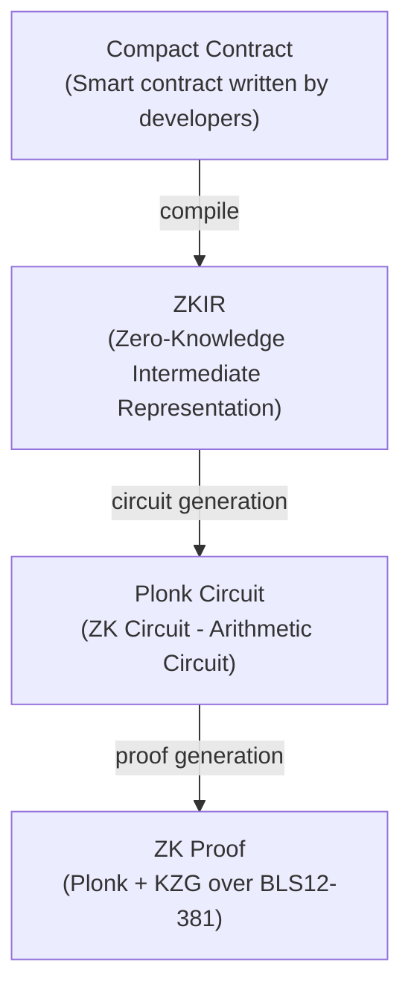
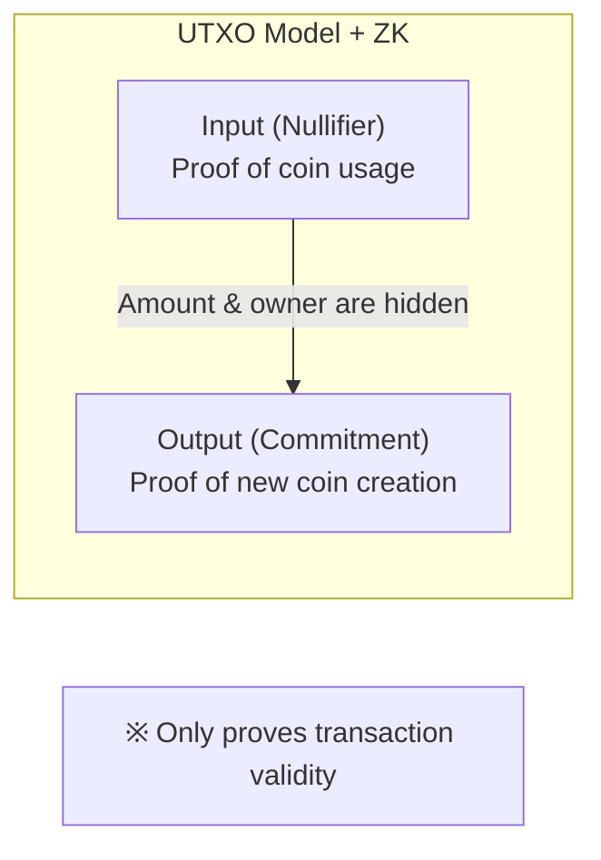
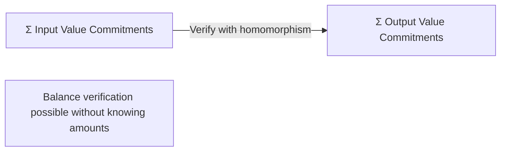
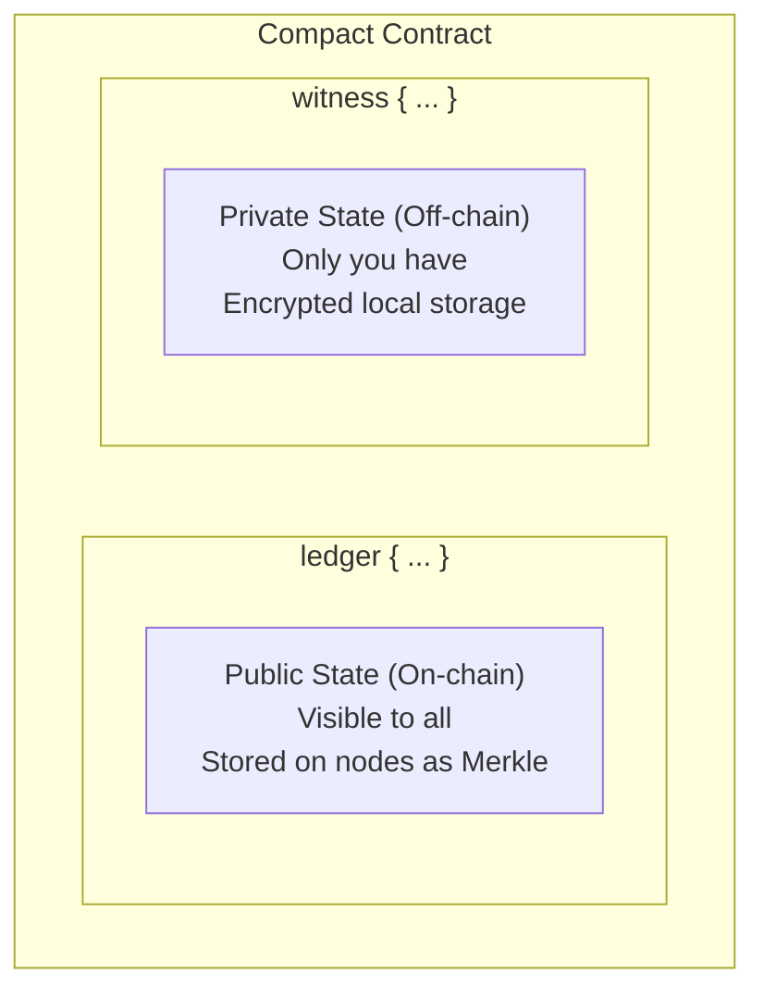
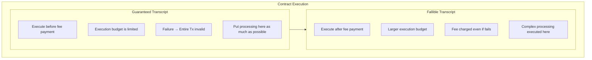
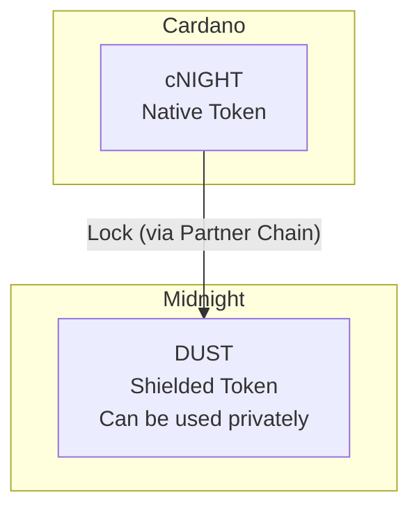
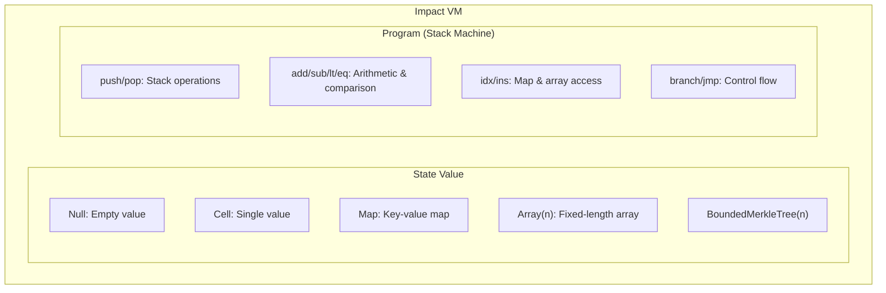
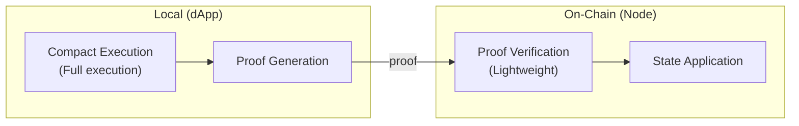

# Core Concepts: Zero-Knowledge Proofs and State Management

This chapter explains the core technical concepts of Midnight. These are the parts that confuse EVM/Solana developers the most, and are also Midnight's strengths.

## Zero-Knowledge Proof (ZKP) Basics

### Why Zero-Knowledge Proofs Are Needed

In traditional blockchains, all data had to be public to verify transactions.

```
Traditional Blockchain:
    "Alice sends 100 ETH to Bob"
    → All nodes can verify
    → Everyone can know
```

Zero-knowledge proofs are a technology that **proves something while revealing no more than necessary for the proof**.

```
Midnight:
    Proof that "this is a valid transaction"
    → Nodes can verify validity
    → But cannot know the amount or parties
```

### Midnight's ZK Stack



### Proof System Details

| Element | Midnight Implementation | Description |
|---------|-------------------------|-------------|
| Proof System | Plonk | Universal and efficient SNARK |
| Commitment | KZG | Polynomial commitment |
| Elliptic Curve | BLS12-381 | Pairing-friendly curve |
| Embedded Curve | JubJub | Efficient curve on BLS12-381 |

**What developers should know:**
- Proof generation is computationally expensive (seconds to tens of seconds)
- Proof verification is fast (millisecond order)
- Trusted Setup is required (already done in Midnight)

## Zswap: Shielded Tokens

### Zswap Concept

Zswap is Midnight's shielded (private) token implementation. Think of it as Zerocash with atomic swaps added.



### Commitment and Nullifier

**Commitment:**
- "Existence proof" of a coin
- Calculated as `Hash(CoinInfo, PublicKey)`
- Stored in on-chain Merkle Tree
- Proves existence while hiding coin contents

**Nullifier:**
- "Usage proof" of a coin
- Calculated as `Hash(CoinInfo, SecretKey)`
- Prevents double spending
- Same coin always generates the same Nullifier

```rust
// Conceptual structure (actual Rust code)
struct CoinInfo {
    value: u128,        // Amount
    type_: RawTokenType, // Token type
    nonce: [u8; 32],    // Random value
}

type CoinCommitment = Hash<(CoinInfo, ZswapCoinPublicKey)>;
type CoinNullifier = Hash<(CoinInfo, ZswapCoinSecretKey)>;
```

### Zswap State

```rust
struct ZswapState {
    // Merkle Tree of commitments
    commitment_tree: MerkleTree<CoinCommitment>,
    
    // Commitment set for duplicate prevention
    commitment_set: Set<CoinCommitment>,
    
    // Set of nullifiers for used coins
    nullifiers: Set<CoinNullifier>,
    
    // Merkle Root history (with expiration)
    commitment_tree_history: TimeFilterMap<MerkleTreeRoot>,
}
```

### Transaction Flow

**1. Input (Using a Coin)**

| Category | Content |
|----------|---------|
| **Proof Content** | My commitment is in Merkle Tree / Correct Nullifier calculated / Value Commitment is correct |
| **Public Information** | Merkle Tree Root / Nullifier / Value Commitment |
| **Hidden Information** | Amount, token type, owner |

**2. Output (Creating a Coin)**

| Category | Content |
|----------|---------|
| **Proof Content** | Commitment is correctly calculated / Value Commitment is correct |
| **Public Information** | Commitment / Value Commitment / Encrypted recipient info (optional) |
| **Hidden Information** | Amount, token type, recipient |

**3. Balance Check**



## Dual State Structure

Midnight's most distinctive concept is the **separation of public and private state**.

### State Model



### Expression in Compact

```compact
// Example: counter.compact

pragma midnight 0.3.0;

// Public state: On-chain, readable by anyone
ledger {
    total_count: Unsigned Integer;
    public_message: Bytes;
}

// Private state is handled implicitly in witness functions
// Example: Per-user balance, vote content, etc.

export circuit increment(
    // witness is private computation
    // Can read/write private state here
): [] {
    ledger.total_count = ledger.total_count + 1;
}
```

### Comparison with EVM

| Aspect | EVM | Midnight |
|--------|-----|----------|
| State Types | Public only | Public + Private |
| State Storage | On-chain | On-chain + Local |
| State Visibility | All public | Selective disclosure |
| Execution Verification | Re-execution | ZK proof |

## Contract Invocation and Effects

### Contract Call Structure

```rust
struct ContractCall {
    address: ContractAddress,          // Contract address
    entry_point: Bytes,                 // Function to call
    guaranteed_transcript: Transcript,  // Part that always executes
    fallible_transcript: Transcript,    // Part that may fail
    communication_commitment: Fr,       // Commitment to I/O
    proof: Proof,                       // ZK proof
}
```

### Guaranteed vs Fallible Transcript



### Effects: Contract Side Effects

Contracts can interact with Zswap and other contracts:

```rust
struct Effects {
    // Interaction with Zswap
    claimed_nullifiers: Set<CoinNullifier>,      // Coins to use
    claimed_shielded_receives: Set<CoinCommitment>, // Coins to receive
    shielded_mints: Map<TokenType, u64>,         // Shielded token minting
    
    // Other contract calls
    claimed_contract_calls: Set<ContractCallClaim>,
    
    // Unshielded token operations
    unshielded_inputs: Map<TokenType, u128>,
    unshielded_outputs: Map<TokenType, u128>,
}
```

## Token Types

### DUST and Night

| Token | Form | Purpose |
|-------|------|---------|
| DUST | Shielded (private) | Private value transfer |
| Night | Unshielded (public) | Gas fees, public transactions |

### cNIGHT: Bridge from Cardano



## On-Chain Execution: Impact VM

### Impact VM Overview

Midnight's on-chain virtual machine (Impact VM) executes contract state transitions.



### Local Execution and On-Chain Verification

Important points developers should understand:

1. **Local Execution**: dApp executes Compact contract and generates result and ZK proof
2. **On-Chain Verification**: Node verifies ZK proof and applies state transition



---

**Next Chapter**: [03-compact-language](./03-compact-language.md) - Compact Language Guide

