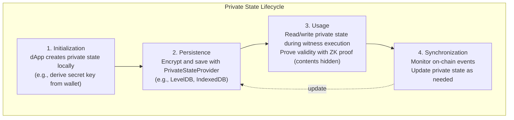

# Compact Language Guide

Compact is a smart contract language designed specifically for Midnight. It prioritizes privacy protection and allows natural description of public state and private computation.

## Language Features

| Feature | Compact | Solidity | Rust (Anchor) |
|---------|---------|----------|---------------|
| Paradigm | Declarative | Imperative | Imperative |
| Type System | Static | Static | Static |
| Privacy | Native Support | None | None |
| ZK Circuit Generation | Automatic | Not possible | Not possible |
| Compilation Target | ZKIR + JS | EVM Bytecode | BPF |

## Basic Syntax

### Hello World: Counter Contract

```compact
// counter.compact
pragma midnight 0.3.0;

// On-chain state (public to all participants)
ledger {
  count: Unsigned Integer;
}

// Increment count by 1
export circuit increment(): [] {
  ledger.count = ledger.count + 1;
}

// Decrement count by 1
export circuit decrement(): [] {
  assert ledger.count > 0;
  ledger.count = ledger.count - 1;
}

// Get current count
export circuit get_count(): Unsigned Integer {
  return ledger.count;
}

// Add specified value
export circuit add(value: Unsigned Integer): [] {
  ledger.count = ledger.count + value;
}
```

### Syntax Element Explanations

#### pragma

Version specification. Important for compatibility.

```compact
pragma midnight 0.3.0;
```

#### ledger Block

Defines **public state**. Stored on-chain and readable by anyone.

```compact
ledger {
  // Simple value
  counter: Unsigned Integer;
  
  // Mapping
  balances: Map<Bytes, Unsigned Integer>;
  
  // Optional value
  owner: Optional<Bytes>;
}
```

**Comparison with EVM:**
```solidity
// Equivalent to Solidity storage variables
contract Counter {
    uint256 public counter;           // ledger { counter: ... }
    mapping(address => uint256) balances; // Map<Bytes, Unsigned Integer>
}
```

#### circuit

Defines contract functions. Adding `export` makes it callable from outside.

```compact
// Callable from outside
export circuit public_function(): [] {
  // ...
}

// Internal only (callable from other circuits)
circuit internal_helper(): Unsigned Integer {
  return 42;
}
```

**Comparison with EVM:**
```solidity
// Equivalent to Solidity functions
function publicFunction() public { ... }  // export circuit
function _internalHelper() internal { ... } // circuit (no export)
```

## Data Types

### Primitive Types

| Compact | Description | Solidity Equivalent |
|---------|-------------|---------------------|
| `Unsigned Integer` | Unsigned integer (u128) | `uint256` |
| `Integer` | Signed integer | `int256` |
| `Boolean` | Boolean value | `bool` |
| `Bytes` | Byte array | `bytes` |
| `Field` | Finite field element | None (ZK-specific) |

### Composite Types

```compact
// Mapping
balances: Map<Bytes, Unsigned Integer>;

// Option
maybe_value: Optional<Unsigned Integer>;

// Tuple
pair: (Unsigned Integer, Bytes);

// Array
items: Vector<Unsigned Integer>;
```

### Structures

```compact
// Structure definition
struct User {
  address: Bytes;
  balance: Unsigned Integer;
  is_active: Boolean;
}

ledger {
  users: Map<Bytes, User>;
}
```

## Privacy: witness

### What is witness

`witness` defines **private computation**. This is Midnight's core feature.

```compact
// Declare witness that handles private state
witness get_my_secret_balance(address: Bytes): Unsigned Integer;

export circuit prove_sufficient_balance(
  required: Unsigned Integer
): Boolean {
  // Call witness (private computation)
  let my_balance = get_my_secret_balance(/* caller's address */);
  
  // Return only the result (balance itself is hidden)
  return my_balance >= required;
}
```

### witness Implementation (TypeScript Side)

`witness` is declared in Compact files and implemented in TypeScript:

```typescript
// witnesses.ts
import { type Witnesses } from './counter'; // generated by compact compile

type PrivateState = {
  myBalance: bigint;
  secretData: Uint8Array;
};

export const witnesses: Witnesses<PrivateState> = {
  get_my_secret_balance: (context) => (address: Uint8Array) => {
    // Get value from private state
    return context.privateState.myBalance;
  },
  
  update_secret: (context) => (newValue: Uint8Array) => {
    // Update private state
    context.privateState.secretData = newValue;
    return;
  }
};
```

### Private State Lifecycle



## Complete Example: Private Voting

```compact
// voting.compact
pragma midnight 0.3.0;

// Public state
ledger {
  // Voting results (only aggregates public)
  yes_votes: Unsigned Integer;
  no_votes: Unsigned Integer;
  
  // Voted marker (hashed address)
  voted: Map<Bytes, Boolean>;
  
  // Voting period
  voting_open: Boolean;
}

// Private computation
witness get_voter_credentials(): (Bytes, Boolean);  // (voter_hash, vote)
witness record_vote(voter_hash: Bytes, vote: Boolean): [];

export circuit cast_vote(): [] {
  assert ledger.voting_open;
  
  // Get voter info and vote privately
  let (voter_hash, vote) = get_voter_credentials();
  
  // Double voting check
  assert !ledger.voted[voter_hash];
  
  // Count vote (vote content hidden, only result reflected)
  if vote {
    ledger.yes_votes = ledger.yes_votes + 1;
  } else {
    ledger.no_votes = ledger.no_votes + 1;
  }
  
  // Mark as voted
  ledger.voted[voter_hash] = true;
  
  // Update private state
  record_vote(voter_hash, vote);
}

export circuit open_voting(): [] {
  ledger.voting_open = true;
}

export circuit close_voting(): [] {
  ledger.voting_open = false;
}
```

## Compilation and Output

### Compilation Command

```bash
compact compile voting.compact ./build
```

### Generated Files

```
build/
├── voting.js           # Contract runtime
├── voting.d.ts         # TypeScript type definitions
├── voting.zkir         # ZK intermediate representation
├── voting.prover.key   # Proof generation key
└── voting.verifier.key # Proof verification key
```

### Generated Type Definitions (Example)

```typescript
// voting.d.ts (auto-generated)
export interface Contract {
  circuits: {
    cast_vote: () => Promise<void>;
    open_voting: () => Promise<void>;
    close_voting: () => Promise<void>;
  };
}

export interface Witnesses<PS> {
  get_voter_credentials: (ctx: WitnessContext<PS>) => () => [Uint8Array, boolean];
  record_vote: (ctx: WitnessContext<PS>) => (voter_hash: Uint8Array, vote: boolean) => void;
}

export interface Ledger {
  yes_votes: bigint;
  no_votes: bigint;
  voted: Map<Uint8Array, boolean>;
  voting_open: boolean;
}
```

## Migration Guide from Solidity

### Pattern Mapping

| Solidity Pattern | Compact Pattern |
|------------------|-----------------|
| `msg.sender` | Get caller info with `witness` |
| `require(...)` | `assert ...` |
| `modifier` | Separate common logic into circuit |
| `event` | `log(...)` function |
| `payable` | Handle with Zswap Effects |

### Access Control

**Solidity:**
```solidity
modifier onlyOwner() {
    require(msg.sender == owner, "Not owner");
    _;
}
```

**Compact:**
```compact
witness get_caller_hash(): Bytes;

circuit check_owner(): [] {
  let caller = get_caller_hash();
  assert caller == ledger.owner;
}

export circuit admin_function(): [] {
  check_owner();
  // ... admin-only processing
}
```

### Token Transfer

**Solidity:**
```solidity
function transfer(address to, uint256 amount) public {
    balances[msg.sender] -= amount;
    balances[to] += amount;
}
```

**Compact + Effects (Private Transfer):**
```compact
// Private transfer with Zswap integration using Effects
// Contract declares Effects,
// Zswap input/output added during transaction construction
```

## Best Practices

### 1. Minimize Private State

```compact
// ✗ Avoid: Unnecessary privatization
witness get_public_data(): Unsigned Integer;

// ✓ Recommended: Private only when needed
// Access public state directly with ledger
export circuit read_public(): Unsigned Integer {
  return ledger.public_counter;
}
```

### 2. Optimize Proof Size

```compact
// ✗ Avoid: Large loops
circuit process_all(): [] {
  for i in 0..1000 {
    // Proof generation becomes very slow
  }
}

// ✓ Recommended: Split batch processing
export circuit process_batch(start: Unsigned Integer, count: Unsigned Integer): [] {
  assert count <= 10;
  // Process in small batches
}
```

### 3. Use Assertions

```compact
export circuit safe_divide(a: Unsigned Integer, b: Unsigned Integer): Unsigned Integer {
  // Prevent division by zero
  assert b > 0;
  return a / b;
}
```

## Development Tools

### Editor Support

- **Zed**: [compact-zed](https://github.com/midnightntwrk/compact-zed) extension
- **VS Code**: tree-sitter based syntax highlighting
- **tree-sitter**: [compact-tree-sitter](https://github.com/midnightntwrk/compact-tree-sitter)

### CLI Tools

```bash
# Compile
compact compile contract.compact ./build
```

---

**Next Chapter**: [04-sdk-development](./04-sdk-development.md) - dApp Development with midnight-js

