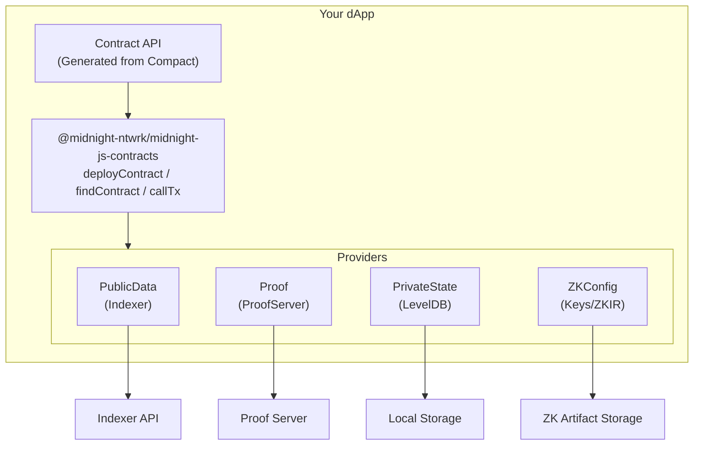

# dApp Development Guide: midnight-js and Wallet SDK

This chapter provides a practical guide to dApp development using midnight-js.

## Development Environment Setup

### Required Packages

```bash
# Main packages
pnpm add @midnight-ntwrk/midnight-js-contracts@latest
pnpm add @midnight-ntwrk/midnight-js-types@latest
pnpm add @midnight-ntwrk/compact-runtime@latest

# Providers
pnpm add @midnight-ntwrk/midnight-js-indexer-public-data-provider@latest
pnpm add @midnight-ntwrk/midnight-js-http-client-proof-provider@latest
pnpm add @midnight-ntwrk/midnight-js-level-private-state-provider@latest
pnpm add @midnight-ntwrk/midnight-js-fetch-zk-config-provider@latest

# Wallet integration
pnpm add @midnight-ntwrk/wallet@latest
pnpm add @midnight-ntwrk/dapp-connector-api@latest
```

### Project Structure

```
my-dapp/
├── contracts/
│   ├── counter.compact          # Compact source code
│   └── build/
│       ├── counter.js           # Compiled runtime
│       ├── counter.d.ts         # Type definitions
│       └── keys/                # ZK keys
├── src/
│   ├── providers/               # Provider configuration
│   ├── witnesses/               # Witness implementation
│   ├── contracts/               # Contract operations
│   └── components/              # UI components
├── package.json
└── tsconfig.json
```

## Architecture Overview



## Provider Configuration

### Complete Configuration Example

```typescript
// src/providers/index.ts
import { 
  createIndexerPublicDataProvider 
} from '@midnight-ntwrk/midnight-js-indexer-public-data-provider';
import { 
  createHttpClientProofProvider 
} from '@midnight-ntwrk/midnight-js-http-client-proof-provider';
import { 
  createLevelPrivateStateProvider 
} from '@midnight-ntwrk/midnight-js-level-private-state-provider';
import { 
  createFetchZkConfigProvider 
} from '@midnight-ntwrk/midnight-js-fetch-zk-config-provider';
import type { 
  PublicDataProvider,
  ProofProvider,
  PrivateStateProvider,
  ZkConfigProvider 
} from '@midnight-ntwrk/midnight-js-types';

// Environment configuration
const config = {
  indexerUrl: 'http://localhost:8088/graphql',
  indexerWsUrl: 'ws://localhost:8088/graphql',
  proofServerUrl: 'http://localhost:6300',
  zkConfigBaseUrl: 'http://localhost:3000/zk-artifacts',
  privateStatePath: './private-state',
};

// PublicDataProvider: Read on-chain state
export const createPublicDataProvider = (): PublicDataProvider => {
  return createIndexerPublicDataProvider({
    httpUri: config.indexerUrl,
    wsUri: config.indexerWsUrl,
  });
};

// ProofProvider: Generate ZK proofs
export const createProofProvider = (): ProofProvider => {
  return createHttpClientProofProvider({
    serverUrl: config.proofServerUrl,
  });
};

// PrivateStateProvider: Persist private state
export const createPrivateStateProvider = <T>(): PrivateStateProvider<T> => {
  return createLevelPrivateStateProvider({
    path: config.privateStatePath,
  });
};

// ZkConfigProvider: Get ZK artifacts
export const createZkConfigProvider = (): ZkConfigProvider => {
  return createFetchZkConfigProvider({
    baseUrl: config.zkConfigBaseUrl,
  });
};
```

## Contract Operations

### Contract Deployment

```typescript
// src/contracts/counter.ts
import { deployContract } from '@midnight-ntwrk/midnight-js-contracts';
import { Contract, Witnesses, Ledger } from '../../contracts/build/counter';
import counterRuntime from '../../contracts/build/counter';
import { witnesses } from '../witnesses/counter';
import { 
  createPublicDataProvider,
  createProofProvider,
  createPrivateStateProvider,
  createZkConfigProvider,
} from '../providers';

// Private state type definition
type CounterPrivateState = {
  localCount: bigint;
};

// Initial private state
const initialPrivateState: CounterPrivateState = {
  localCount: 0n,
};

export async function deployCounterContract() {
  // Create providers
  const publicDataProvider = createPublicDataProvider();
  const proofProvider = createProofProvider();
  const privateStateProvider = createPrivateStateProvider<CounterPrivateState>();
  const zkConfigProvider = createZkConfigProvider();

  // Deploy contract
  const { contractAddress, initialLedger } = await deployContract({
    // Runtime generated from Compact
    runtime: counterRuntime,
    
    // Witness implementation
    witnesses: witnesses,
    
    // Providers
    publicDataProvider,
    proofProvider,
    privateStateProvider,
    zkConfigProvider,
    
    // Initial state
    initialPrivateState,
    
    // Deployment configuration
    deployArgs: {
      count: 0n, // Initial value for ledger
    },
  });

  console.log('Contract deployed at:', contractAddress);
  console.log('Initial ledger state:', initialLedger);
  
  return { contractAddress, initialLedger };
}
```

### Connecting to Existing Contract

```typescript
// src/contracts/connect.ts
import { findContract } from '@midnight-ntwrk/midnight-js-contracts';
import counterRuntime from '../../contracts/build/counter';
import { witnesses } from '../witnesses/counter';

export async function connectToContract(contractAddress: string) {
  const publicDataProvider = createPublicDataProvider();
  const proofProvider = createProofProvider();
  const privateStateProvider = createPrivateStateProvider<CounterPrivateState>();
  const zkConfigProvider = createZkConfigProvider();

  const contract = await findContract({
    runtime: counterRuntime,
    witnesses,
    publicDataProvider,
    proofProvider,
    privateStateProvider,
    zkConfigProvider,
    contractAddress,
    privateState: await privateStateProvider.get(contractAddress),
  });

  return contract;
}
```

### Circuit Invocation

```typescript
// src/contracts/operations.ts
import { callTx } from '@midnight-ntwrk/midnight-js-contracts';

export async function incrementCounter(contract: Contract) {
  // Call circuit
  const result = await callTx(contract, 'increment', {
    // Pass arguments here if any
  });

  console.log('Transaction submitted:', result.txHash);
  console.log('New ledger state:', result.ledger);
  
  return result;
}

export async function addToCounter(contract: Contract, value: bigint) {
  const result = await callTx(contract, 'add', {
    value,
  });

  return result;
}

export async function getCurrentCount(contract: Contract): Promise<bigint> {
  // Read-only circuit
  const result = await callTx(contract, 'get_count', {});
  return result.returnValue as bigint;
}
```

## Witness Implementation

### Basic Witness

```typescript
// src/witnesses/counter.ts
import type { Witnesses, WitnessContext } from '../../contracts/build/counter';

type CounterPrivateState = {
  localCount: bigint;
  secretMultiplier: bigint;
};

export const witnesses: Witnesses<CounterPrivateState> = {
  // Simple read
  get_local_count: (context: WitnessContext<CounterPrivateState>) => () => {
    return context.privateState.localCount;
  },
  
  // Read and update
  increment_local: (context: WitnessContext<CounterPrivateState>) => () => {
    const current = context.privateState.localCount;
    context.privateState.localCount = current + 1n;
    return current + 1n;
  },
  
  // Witness with arguments
  apply_multiplier: (context: WitnessContext<CounterPrivateState>) => 
    (value: bigint) => {
      return value * context.privateState.secretMultiplier;
    },
  
  // Complex computation
  compute_hash: (context: WitnessContext<CounterPrivateState>) => 
    (data: Uint8Array) => {
      // Private computation
      const hash = crypto.subtle.digestSync('SHA-256', data);
      return new Uint8Array(hash);
    },
};
```

### Async Witness

```typescript
// Witnesses must be synchronous,
// so resolve async operations beforehand if needed

export async function createWitnessesWithAsyncData(userId: string) {
  // Pre-fetch async data
  const userData = await fetchUserData(userId);
  
  const witnesses: Witnesses<PrivateState> = {
    get_user_credential: (context) => () => {
      // Use pre-fetched data
      return userData.credential;
    },
  };
  
  return witnesses;
}
```

## Wallet Integration

### DApp Connector API

```typescript
// src/wallet/connector.ts
import { 
  DAppConnector, 
  type WalletAPI 
} from '@midnight-ntwrk/dapp-connector-api';

let walletApi: WalletAPI | null = null;

export async function connectWallet(): Promise<WalletAPI> {
  // Detect wallet extension
  const connector = new DAppConnector();
  
  // Get available wallets
  const wallets = await connector.getAvailableWallets();
  
  if (wallets.length === 0) {
    throw new Error('No Midnight wallet found. Please install a compatible wallet.');
  }
  
  // Connect to first wallet
  walletApi = await connector.connect(wallets[0].id);
  
  console.log('Connected to wallet:', wallets[0].name);
  
  return walletApi;
}

export async function getWalletAddress(): Promise<string> {
  if (!walletApi) {
    throw new Error('Wallet not connected');
  }
  
  const addresses = await walletApi.getAddresses();
  return addresses[0];
}

export async function signAndSubmitTransaction(tx: unknown): Promise<string> {
  if (!walletApi) {
    throw new Error('Wallet not connected');
  }
  
  // Balance adjustment and signing with wallet
  const signedTx = await walletApi.balanceAndSign(tx);
  
  // Submit transaction
  const txHash = await walletApi.submitTransaction(signedTx);
  
  return txHash;
}
```

### NodeProvider Integration

```typescript
// src/providers/node.ts
import { createNodeProvider } from '@midnight-ntwrk/midnight-js-types';

export function createNodeProviderWithWallet(walletApi: WalletAPI) {
  return createNodeProvider({
    // Submit transaction via wallet
    submitTransaction: async (tx) => {
      const signedTx = await walletApi.balanceAndSign(tx);
      return walletApi.submitTransaction(signedTx);
    },
  });
}
```

## State Subscription

### Real-time Updates

```typescript
// src/subscriptions/ledger.ts
import { subscribeToLedger } from '@midnight-ntwrk/midnight-js-contracts';

export async function watchContractState(
  contract: Contract,
  onUpdate: (ledger: Ledger) => void
) {
  const subscription = await subscribeToLedger(contract, {
    onLedgerUpdate: (newLedger) => {
      console.log('Ledger updated:', newLedger);
      onUpdate(newLedger);
    },
    onError: (error) => {
      console.error('Subscription error:', error);
    },
  });

  // Return cleanup function
  return () => subscription.unsubscribe();
}
```

### Block Monitoring

```typescript
// src/subscriptions/blocks.ts
import { createPublicDataProvider } from '../providers';

export async function watchNewBlocks(onBlock: (block: Block) => void) {
  const provider = createPublicDataProvider();
  
  const subscription = await provider.subscribeToNewBlocks({
    onBlock,
    onError: (error) => {
      console.error('Block subscription error:', error);
    },
  });

  return () => subscription.unsubscribe();
}
```

## React Integration Example

### Contract Hook

```typescript
// src/hooks/useContract.ts
import { useState, useEffect, useCallback } from 'react';
import { Contract, Ledger } from '../../contracts/build/counter';
import { connectToContract, incrementCounter } from '../contracts/counter';

export function useCounterContract(contractAddress: string) {
  const [contract, setContract] = useState<Contract | null>(null);
  const [ledger, setLedger] = useState<Ledger | null>(null);
  const [loading, setLoading] = useState(true);
  const [error, setError] = useState<Error | null>(null);

  // Contract connection
  useEffect(() => {
    let mounted = true;
    
    async function connect() {
      try {
        const c = await connectToContract(contractAddress);
        if (mounted) {
          setContract(c);
          setLedger(c.ledger);
          setLoading(false);
        }
      } catch (e) {
        if (mounted) {
          setError(e as Error);
          setLoading(false);
        }
      }
    }
    
    connect();
    
    return () => { mounted = false; };
  }, [contractAddress]);

  // Increment function
  const increment = useCallback(async () => {
    if (!contract) return;
    
    setLoading(true);
    try {
      const result = await incrementCounter(contract);
      setLedger(result.ledger);
    } catch (e) {
      setError(e as Error);
    } finally {
      setLoading(false);
    }
  }, [contract]);

  return {
    contract,
    ledger,
    loading,
    error,
    increment,
  };
}
```

### Component Example

```tsx
// src/components/Counter.tsx
import React from 'react';
import { useCounterContract } from '../hooks/useContract';

interface CounterProps {
  contractAddress: string;
}

export function Counter({ contractAddress }: CounterProps) {
  const { ledger, loading, error, increment } = useCounterContract(contractAddress);

  if (loading) return <div>Loading contract...</div>;
  if (error) return <div>Error: {error.message}</div>;
  if (!ledger) return <div>No ledger state</div>;

  return (
    <div className="counter">
      <h2>Counter Contract</h2>
      <p>Current count: {ledger.count.toString()}</p>
      <button onClick={increment} disabled={loading}>
        {loading ? 'Processing...' : 'Increment'}
      </button>
    </div>
  );
}
```

## Error Handling

### Common Errors and Solutions

```typescript
// src/utils/errors.ts
export class MidnightError extends Error {
  constructor(
    message: string,
    public code: string,
    public details?: unknown
  ) {
    super(message);
    this.name = 'MidnightError';
  }
}

export function handleContractError(error: unknown): never {
  if (error instanceof Error) {
    // Proof generation error
    if (error.message.includes('proof generation failed')) {
      throw new MidnightError(
        'Failed to generate ZK proof. Please try again.',
        'PROOF_GENERATION_FAILED',
        error
      );
    }
    
    // Indexer connection error
    if (error.message.includes('indexer')) {
      throw new MidnightError(
        'Cannot connect to indexer. Please check your connection.',
        'INDEXER_CONNECTION_FAILED',
        error
      );
    }
    
    // Assertion failure
    if (error.message.includes('assertion failed')) {
      throw new MidnightError(
        'Contract assertion failed. Check your input values.',
        'ASSERTION_FAILED',
        error
      );
    }
  }
  
  throw new MidnightError(
    'Unknown error occurred',
    'UNKNOWN_ERROR',
    error
  );
}
```

## Testing

### Unit Tests

```typescript
// src/__tests__/witnesses.test.ts
import { describe, it, expect } from 'vitest';
import { witnesses } from '../witnesses/counter';

describe('Counter Witnesses', () => {
  it('should increment local count', () => {
    const mockContext = {
      privateState: { localCount: 5n },
    };
    
    const result = witnesses.increment_local(mockContext)();
    
    expect(result).toBe(6n);
    expect(mockContext.privateState.localCount).toBe(6n);
  });
});
```

### Integration Tests

```typescript
// src/__tests__/contract.integration.test.ts
import { describe, it, expect, beforeAll } from 'vitest';
import { deployCounterContract, connectToContract } from '../contracts/counter';

describe('Counter Contract Integration', () => {
  let contractAddress: string;
  
  beforeAll(async () => {
    // Deploy test contract
    const { contractAddress: addr } = await deployCounterContract();
    contractAddress = addr;
  }, 60000); // Longer timeout for proof generation
  
  it('should increment counter', async () => {
    const contract = await connectToContract(contractAddress);
    
    const initialCount = contract.ledger.count;
    await incrementCounter(contract);
    const newCount = contract.ledger.count;
    
    expect(newCount).toBe(initialCount + 1n);
  }, 30000);
});
```

---

**Next Chapter**: [05-infrastructure](./05-infrastructure.md) - Infrastructure Guide

