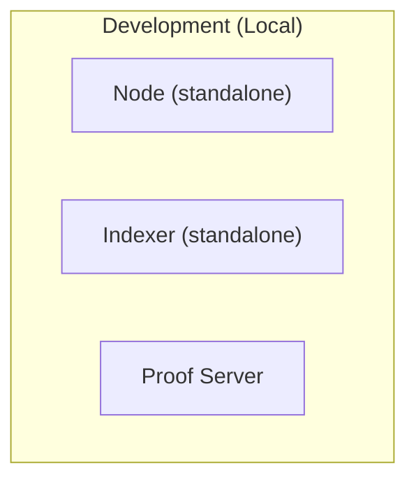
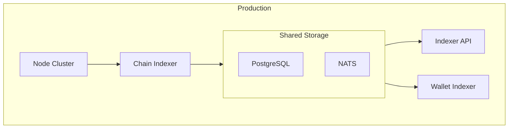
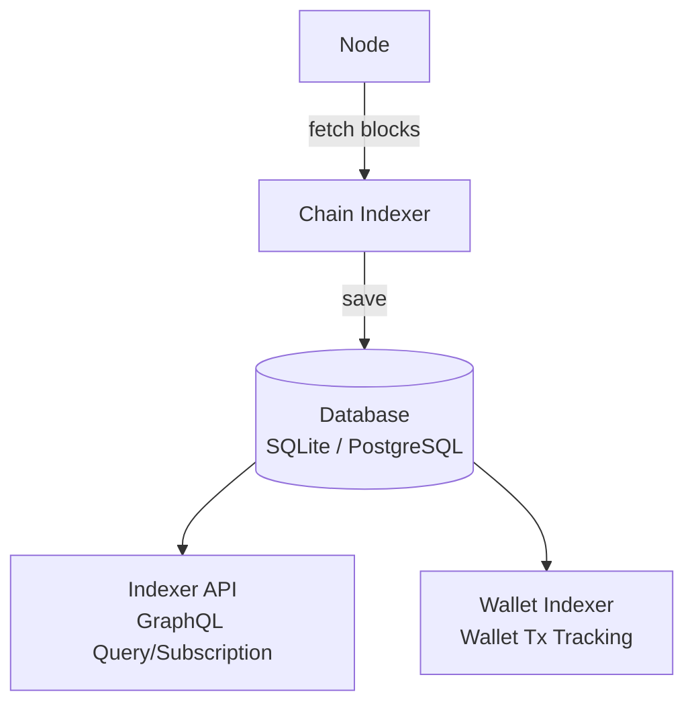
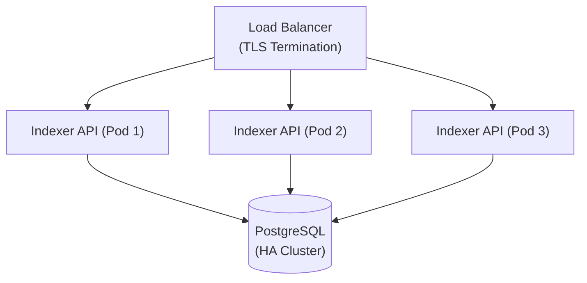

# Infrastructure Guide: Node and Indexer

This chapter explains the operation and configuration of Midnight's infrastructure components.

## Overview





## Midnight Node

### Starting with Docker (Recommended)

```bash
# Clone repository
git clone https://github.com/midnightntwrk/midnight-node-docker
cd midnight-node-docker

# Start
docker-compose up -d
```

### Configuration Parameters

| Parameter | Environment Variable | Default | Description |
|-----------|---------------------|---------|-------------|
| Chain | `CHAIN` | `local` | Network to connect to |
| Base Path | `BASE_PATH` | `/data` | Data directory |
| Validator Mode | `VALIDATOR` | `false` | Run as validator |
| RPC Port | `--rpc-port` | `9944` | WebSocket RPC |
| P2P Port | `--port` | `30333` | P2P network |

### Development Single Node

```bash
# Create seed file
echo "//Alice" > /tmp/alice-seed

# Start
CFG_PRESET=dev \
AURA_SEED_FILE=/tmp/alice-seed \
GRANDPA_SEED_FILE=/tmp/alice-seed \
CROSS_CHAIN_SEED_FILE=/tmp/alice-seed \
BASE_PATH=/tmp/node-1 \
CHAIN=local \
VALIDATOR=true \
./midnight-node
```

### Available Networks

| Network | Purpose | Cardano Connection |
|---------|---------|-------------------|
| `local` | Local development | None |
| `qanet` | QA testing | Preview |
| `preview` | Staging | Preview |
| `perfnet` | Performance testing | Preview |

### RPC Endpoints

Node provides WebSocket RPC:

```typescript
// WebSocket connection
const ws = new WebSocket('ws://localhost:9944');

// Basic query
ws.send(JSON.stringify({
  jsonrpc: '2.0',
  id: 1,
  method: 'system_health',
  params: []
}));
```

**Main RPC Methods:**
- `system_health`: Node health status
- `chain_getBlock`: Get block
- `state_getRuntimeVersion`: Runtime version
- `author_submitExtrinsic`: Submit transaction

## Midnight Indexer

### Architecture



### Standalone Mode (Development)

All components run as a single binary + SQLite.

```bash
docker run -d \
  --name midnight-indexer \
  -p 8088:8088 \
  -e APP__INFRA__NODE__URL=ws://host.docker.internal:9944 \
  -e APP__INFRA__SECRET=<hex-encoded-32-bytes> \
  -v indexer-data:/data \
  midnightntwrk/indexer-standalone
```

**Environment Variables:**
| Variable | Default | Description |
|----------|---------|-------------|
| `APP__INFRA__NODE__URL` | `ws://localhost:9944` | Node WebSocket URL |
| `APP__INFRA__STORAGE__CNN_URL` | `/data/indexer.sqlite` | SQLite path |
| `APP__INFRA__API__PORT` | `8088` | GraphQL API port |
| `APP__INFRA__SECRET` | - | Encryption secret (32-byte hex) |

### Cloud Mode (Production)

Each component runs separately using PostgreSQL and NATS.

```yaml
# docker-compose.yml (simplified)
version: '3.8'
services:
  postgres:
    image: postgres:15
    environment:
      POSTGRES_DB: indexer
      POSTGRES_USER: indexer
      POSTGRES_PASSWORD: ${DB_PASSWORD}
    volumes:
      - postgres-data:/var/lib/postgresql/data

  nats:
    image: nats:2.10
    command: ["--jetstream"]

  chain-indexer:
    image: midnightntwrk/chain-indexer
    depends_on: [postgres, nats]
    environment:
      APP__INFRA__STORAGE__HOST: postgres
      APP__INFRA__STORAGE__PASSWORD: ${DB_PASSWORD}
      APP__INFRA__PUB_SUB__URL: nats:4222
      APP__INFRA__NODE__URL: ws://midnight-node:9944

  indexer-api:
    image: midnightntwrk/indexer-api
    depends_on: [postgres, nats]
    ports:
      - "8088:8088"
    environment:
      APP__INFRA__STORAGE__HOST: postgres
      APP__INFRA__STORAGE__PASSWORD: ${DB_PASSWORD}
      APP__INFRA__PUB_SUB__URL: nats:4222
      APP__INFRA__SECRET: ${INDEXER_SECRET}

  wallet-indexer:
    image: midnightntwrk/wallet-indexer
    depends_on: [postgres, nats]
    environment:
      APP__INFRA__STORAGE__HOST: postgres
      APP__INFRA__STORAGE__PASSWORD: ${DB_PASSWORD}
      APP__INFRA__PUB_SUB__URL: nats:4222
      APP__INFRA__SECRET: ${INDEXER_SECRET}

volumes:
  postgres-data:
```

### GraphQL API

Indexer provides a GraphQL API.

**Endpoints:**
- HTTP: `http://localhost:8088/graphql`
- WebSocket: `ws://localhost:8088/graphql`

**Query Examples:**

```graphql
# Get block information
query GetBlock($hash: HexString!) {
  block(hash: $hash) {
    height
    hash
    parentHash
    timestamp
    transactions {
      hash
      status
    }
  }
}

# Get latest blocks
query GetLatestBlocks($limit: Int!) {
  blocks(first: $limit, orderBy: HEIGHT_DESC) {
    nodes {
      height
      hash
      timestamp
    }
  }
}

# Get contract actions
query GetContractActions($address: HexString!) {
  contractActions(contractAddress: $address) {
    nodes {
      txHash
      blockHeight
      entryPoint
      status
    }
  }
}
```

**Subscription Examples:**

```graphql
# Monitor new blocks
subscription OnNewBlock {
  newBlock {
    height
    hash
    timestamp
  }
}

# Monitor contract actions
subscription OnContractAction($address: HexString!) {
  contractAction(contractAddress: $address) {
    txHash
    entryPoint
    status
  }
}
```

## Proof Server

Proof generation server. Runs as a separate process due to computational intensity.

### Starting

```bash
docker run -d \
  --name proof-server \
  -p 6300:6300 \
  -v zk-keys:/keys \
  midnightntwrk/proof-server \
  --key-dir /keys
```

### API

```typescript
// POST /prove
const response = await fetch('http://localhost:6300/prove', {
  method: 'POST',
  headers: { 'Content-Type': 'application/json' },
  body: JSON.stringify({
    circuit: 'counter/increment',
    inputs: { /* ... */ },
  }),
});

const { proof, publicInputs } = await response.json();
```

## Development Environment Setup

### Complete Development Environment with docker-compose

```yaml
# docker-compose.dev.yml
version: '3.8'

services:
  midnight-node:
    image: midnightntwrk/midnight-node:latest
    ports:
      - "9944:9944"
      - "30333:30333"
    environment:
      - CHAIN=local
      - VALIDATOR=true
      - CFG_PRESET=dev
    volumes:
      - node-data:/data
    command: >
      --dev
      --ws-external
      --rpc-external
      --rpc-cors all

  midnight-indexer:
    image: midnightntwrk/indexer-standalone:latest
    depends_on:
      - midnight-node
    ports:
      - "8088:8088"
    environment:
      APP__INFRA__NODE__URL: ws://midnight-node:9944
      APP__INFRA__SECRET: 0102030405060708090a0b0c0d0e0f101112131415161718191a1b1c1d1e1f20
    volumes:
      - indexer-data:/data

  proof-server:
    image: midnightntwrk/proof-server:latest
    ports:
      - "6300:6300"
    volumes:
      - zk-keys:/keys

volumes:
  node-data:
  indexer-data:
  zk-keys:
```

### Starting and Verification

```bash
# Start
docker-compose -f docker-compose.dev.yml up -d

# Check logs
docker-compose -f docker-compose.dev.yml logs -f

# Health checks
curl http://localhost:9944/health          # Node
curl http://localhost:8088/graphql         # Indexer (GraphQL Playground)
curl http://localhost:6300/health          # Proof Server
```

## Monitoring and Troubleshooting

### Health Checks

```bash
# Node health status
curl -X POST http://localhost:9944 \
  -H "Content-Type: application/json" \
  -d '{"jsonrpc":"2.0","id":1,"method":"system_health","params":[]}'

# Expected response
# {"jsonrpc":"2.0","result":{"peers":2,"isSyncing":false,"shouldHavePeers":true},"id":1}
```

### Common Issues

| Issue | Cause | Solution |
|-------|-------|----------|
| Cannot connect to Node | Port is closed | Add `--ws-external --rpc-external` |
| Indexer not syncing | Wrong Node URL | Check `APP__INFRA__NODE__URL` |
| Slow proof generation | Insufficient resources | Increase CPU/memory, dedicated server |
| Transaction failure | Nonce mismatch | Restart Node, reset state |

### Log Level Configuration

```bash
# Node log level
RUST_LOG=info,midnight=debug ./midnight-node

# Indexer log level
docker run -e RUST_LOG=debug midnightntwrk/indexer-standalone
```

## Migration to Production

### Checklist

- [ ] **Security**
  - Secure secret management (Vault, AWS Secrets Manager)
  - Firewall configuration (RPC internal network only)
  - TLS termination

- [ ] **Scaling**
  - Node cluster configuration
  - Indexer API horizontal scaling
  - PostgreSQL replication

- [ ] **Monitoring**
  - Metrics collection (Prometheus)
  - Dashboard (Grafana)
  - Alert configuration

- [ ] **Backup**
  - Regular DB backups
  - Node data snapshots

### Recommended Configuration



---

**Next Chapter**: [06-comparison](./06-comparison.md) - Detailed Comparison with EVM/Solana

