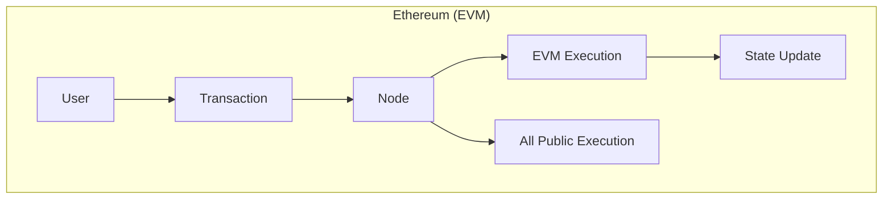
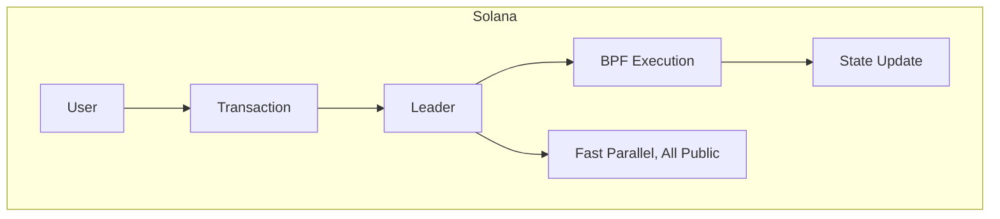
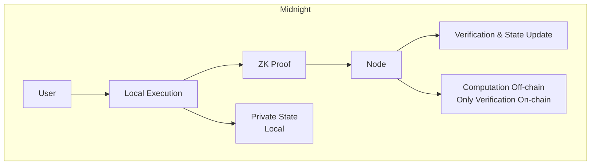

# Comparison Guide for EVM/Solana Developers

This chapter provides a detailed comparison of Midnight with EVM (Ethereum) and Solana for developers with experience in those platforms.

## Architecture Comparison







## Key Concept Mapping

### State Management

| Concept | Ethereum | Solana | Midnight |
|---------|----------|--------|----------|
| Public State | Storage (contract) | Account Data | `ledger { ... }` |
| Private State | None | None | `witness` + local storage |
| State Visibility | All public | All public | Selective |
| State Model | Account-based | Account-based | Hybrid (Account + UTXO) |

### Smart Contracts

| Aspect | Ethereum | Solana | Midnight |
|--------|----------|--------|----------|
| Language | Solidity, Vyper | Rust (Anchor) | Compact |
| Execution Environment | EVM | BPF/SBF | Impact VM + ZK Circuit |
| Execution Location | On-chain | On-chain | Off-chain + On-chain verification |
| Gas/Fee | Gas (ETH) | Compute Units (SOL) | DUST |
| Deployment Cost | Medium-High | Low | Medium (includes ZK keys) |

### Tokens

| Aspect | Ethereum | Solana | Midnight |
|--------|----------|--------|----------|
| Native Currency | ETH | SOL | DUST (shielded) / Night (unshielded) |
| Token Standard | ERC-20, ERC-721 | SPL Token | Zswap tokens |
| Privacy | None (requires Tornado Cash, etc.) | None | Native support |
| Transfer Visibility | All public | All public | Can be encrypted |

## Code Comparison

### Basic Counter

**Solidity (Ethereum):**
```solidity
// SPDX-License-Identifier: MIT
pragma solidity ^0.8.0;

contract Counter {
    uint256 public count;
    
    function increment() public {
        count += 1;
    }
    
    function decrement() public {
        require(count > 0, "Count is zero");
        count -= 1;
    }
    
    function getCount() public view returns (uint256) {
        return count;
    }
}
```

**Rust/Anchor (Solana):**
```rust
use anchor_lang::prelude::*;

declare_id!("Counter111111111111111111111111111111111111");

#[program]
pub mod counter {
    use super::*;
    
    pub fn increment(ctx: Context<Increment>) -> Result<()> {
        ctx.accounts.counter.count += 1;
        Ok(())
    }
    
    pub fn decrement(ctx: Context<Decrement>) -> Result<()> {
        require!(ctx.accounts.counter.count > 0, CounterError::CountIsZero);
        ctx.accounts.counter.count -= 1;
        Ok(())
    }
}

#[account]
pub struct CounterAccount {
    pub count: u64,
}
```

**Compact (Midnight):**
```compact
pragma midnight 0.3.0;

ledger {
    count: Unsigned Integer;
}

export circuit increment(): [] {
    ledger.count = ledger.count + 1;
}

export circuit decrement(): [] {
    assert ledger.count > 0;
    ledger.count = ledger.count - 1;
}

export circuit get_count(): Unsigned Integer {
    return ledger.count;
}
```

### Token with Private Balance

**Ethereum: No Privacy**
```solidity
contract Token {
    mapping(address => uint256) public balances;  // All public
    
    function transfer(address to, uint256 amount) public {
        // Anyone can see balances and transfers
        balances[msg.sender] -= amount;
        balances[to] += amount;
    }
}
```

**Midnight: With Privacy**
```compact
pragma midnight 0.3.0;

ledger {
    // Only total supply is public
    total_supply: Unsigned Integer;
    // Balances managed privately
}

witness get_my_balance(): Unsigned Integer;
witness update_balance(delta: Integer): [];
witness get_recipient_key(): Bytes;

export circuit transfer(amount: Unsigned Integer): [] {
    // Check balance privately
    let my_balance = get_my_balance();
    assert my_balance >= amount;
    
    // Update balance (private)
    update_balance(-amount as Integer);
    
    // Transfer to recipient (via Zswap, details hidden)
    // Declare Zswap output with Effects
}
```

### Access Control

**Solidity:**
```solidity
contract Owned {
    address public owner;
    
    modifier onlyOwner() {
        require(msg.sender == owner, "Not owner");
        _;
    }
    
    function adminFunction() public onlyOwner {
        // Admin only
    }
}
```

**Compact:**
```compact
ledger {
    owner_hash: Bytes;  // Owner's public key hash
}

witness get_caller_hash(): Bytes;

circuit check_owner(): [] {
    let caller = get_caller_hash();
    assert caller == ledger.owner_hash;
}

export circuit admin_function(): [] {
    check_owner();
    // Admin-only processing
}
```

## Development Flow Comparison

### Ethereum Development Flow

```
1. Create contract in Solidity
2. Compile with Hardhat/Foundry
3. Deploy to testnet
4. Frontend integration with ethers.js/viem
5. Sign transactions with MetaMask, etc.
```

### Solana Development Flow

```
1. Create program in Rust/Anchor
2. Compile with anchor build
3. Deploy to testnet
4. Frontend integration with @solana/web3.js
5. Sign transactions with Phantom, etc.
```

### Midnight Development Flow

```
1. Create contract in Compact
2. Compile with compact compile (→ JS, type definitions, ZK keys)
3. Implement witnesses in TypeScript
4. Frontend integration with midnight-js
5. Generate ZK proof + sign with Midnight Wallet
6. Deploy to testnet/local
```

## Feature Comparison Table

### Transactions

| Feature | Ethereum | Solana | Midnight |
|---------|----------|--------|----------|
| Confirmation Time | ~12 seconds | ~400ms | ~6 seconds |
| Finality | Probabilistic (~12 min) | Probabilistic (~20 sec) | Deterministic (GRANDPA) |
| Max TPS | ~15-30 | ~65,000 | In development |
| Fee Model | Auction | Fixed + priority fee | Fixed |

### Privacy

| Feature | Ethereum | Solana | Midnight |
|---------|----------|--------|----------|
| Transaction Content | All public | All public | Can be encrypted |
| Balance | All public | All public | Can be hidden |
| Sender/Receiver | All public | All public | Can be hidden |
| Contract State | All public | All public | Selective disclosure |
| ZK Proof | Requires separate implementation | Requires separate implementation | Native |

### Developer Experience

| Aspect | Ethereum | Solana | Midnight |
|--------|----------|--------|----------|
| Learning Curve | Low-Medium | Medium-High | Medium |
| Tool Maturity | Very High | High | Growing |
| Documentation | Abundant | Abundant | Increasing |
| Community | Largest | Large | Growing |
| TypeScript Support | Good | Good | Very Good |

## Migration Patterns

### Ethereum → Midnight

| Ethereum Pattern | Midnight Equivalent |
|------------------|---------------------|
| `msg.sender` | Get caller info with `witness` |
| `require(condition)` | `assert condition` |
| `modifier` | Separate common logic into circuit |
| `event Log(...)` | `log(...)` function |
| `payable` | Zswap Effects |
| `mapping(address => uint)` | `Map<Bytes, Unsigned Integer>` |
| `ERC-20 transfer` | Zswap + witness |
| `Ownable` | `ledger.owner` + witness verification |

### Solana → Midnight

| Solana Pattern | Midnight Equivalent |
|----------------|---------------------|
| `#[account]` | `ledger { ... }` |
| Program ID | Contract Address |
| PDAs | Contract-owned state |
| `require!` | `assert` |
| CPI (Cross-Program Invocation) | Call another contract |
| SPL Token | Zswap tokens |
| Anchor Events | `log(...)` |

## Common Misconceptions and Notes

### 1. Not Everything is Private

```compact
// Public state = readable by anyone
ledger {
    public_counter: Unsigned Integer;  // Public
}

// Private = witness + local storage
witness get_private_data(): Bytes;  // Only you
```

### 2. Cost of Proof Generation

```
Ethereum:  tx send ──→ ~0.1 seconds
Solana:     tx send ──→ ~0.1 seconds
Midnight:   proof generation ──→ tx send ──→ seconds to tens of seconds
               │
               └─ This time is added
```

### 3. Meaning of Off-Chain Computation

```
EVM:     All nodes execute the same computation
Midnight: 1 person computes → Everyone verifies proof
          ↓
          Computation validity is guaranteed
          Computation contents are hidden
```

### 4. State Size Differences

```
Ethereum: Transaction data stored as-is
Midnight: Proof size is fixed regardless of input size
          ↓
          Proof remains small even with large private data
```

## Performance Considerations

### Proof Generation Time Estimates

| Complexity | Proof Generation Time |
|------------|---------------------|
| Simple state update | 2-5 seconds |
| Medium computation | 5-15 seconds |
| Complex logic | 15-60 seconds |

### Optimization Tips

1. **Minimize Circuit Size**
   - Avoid loop unrolling
   - Remove unnecessary computations
   - Split batch processing

2. **Caching**
   - Pre-load proof keys
   - Local cache for frequently used data

3. **Parallelization**
   - Generate multiple independent proofs in parallel
   - Scale Proof Server

## When to Choose Midnight

### Midnight is Suitable When

- ✅ Privacy is a mandatory requirement
- ✅ Selective disclosure needed for compliance
- ✅ DeFi handling confidential data
- ✅ Private voting & governance
- ✅ Applications handling personal information

### Other Chains are Suitable When

- ⚠️ Ultra-high frequency trading (HFT) → Solana
- ⚠️ Maximum liquidity needed → Ethereum
- ⚠️ Complete transparency needed → EVM chains
- ⚠️ Minimum latency required → Solana

---

**Next Chapter**: [07-resources](./07-resources.md) - Resources and Next Steps

