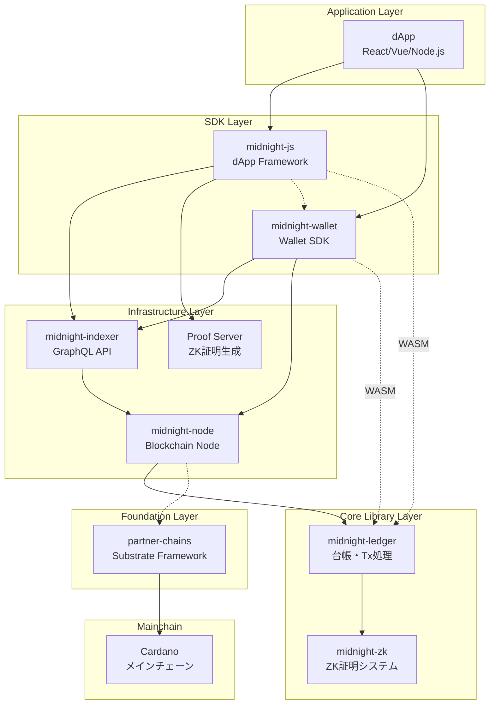
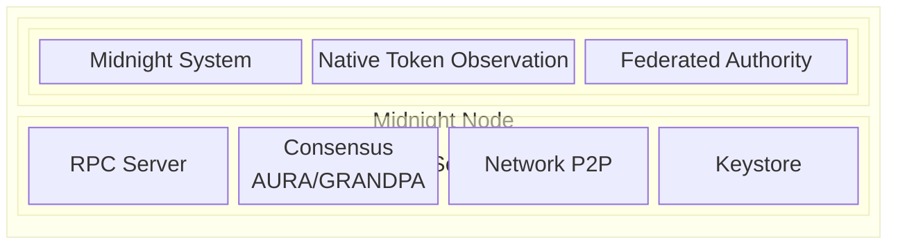
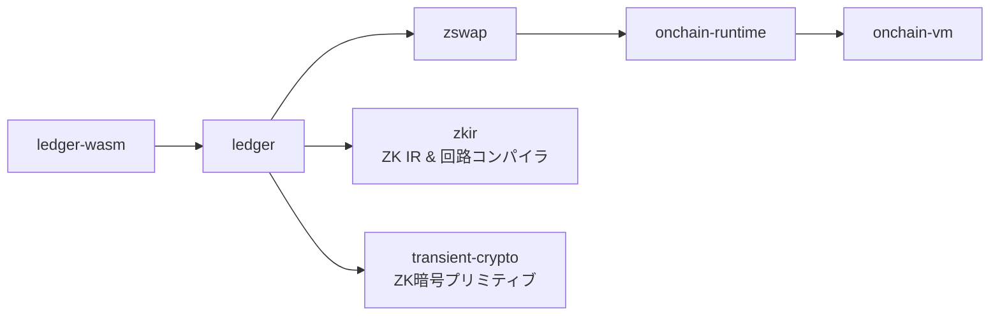
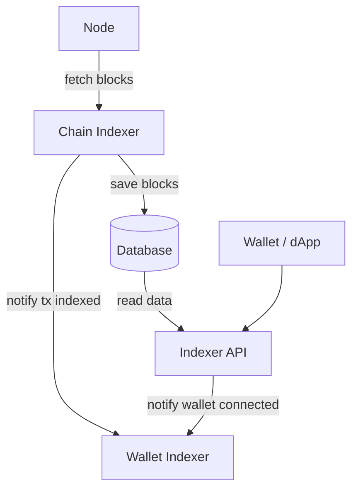
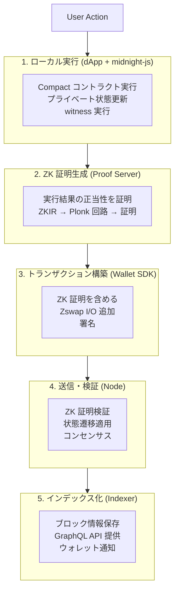

# アーキテクチャ全体像

Midnight は複数のコンポーネントが連携して動作するシステムです。各コンポーネントの役割と相互関係を理解することで、dApp 開発時の設計判断が容易になります。

## システム全体図

**凡例:**
- 実線 → 直接的な依存・通信
- 点線 → ライブラリ依存（WASM バインディング等）

## 各コンポーネントの詳細

### midnight-node

**役割**: Midnight ブロックチェーンのコアノード実装

| 項目 | 詳細 |
|------|------|
| 言語 | Rust |
| ベース | Substrate (Polkadot SDK) |
| コンセンサス | AURA (ブロック生成) + GRANDPA (ファイナリティ) |
| ブロック時間 | 6秒 |
| ポート | WebSocket RPC: 9944 / P2P: 30333 |

**主要 Pallet:**
- `pallet-midnight`: コアトランザクション処理、ZK証明検証
- `pallet-midnight-system`: システムトランザクション管理
- `pallet-native-token-observation`: Cardano ブリッジ (cNIGHT → DUST)
- `pallet-federated-authority`: 複合ガバナンス

---

### midnight-ledger

**役割**: 台帳実装、トランザクション構造、状態管理

| 項目 | 詳細 |
|------|------|
| 言語 | Rust + WASM (TypeScript API) |
| 主要機能 | トランザクション処理、ZK証明検証、コントラクトランタイム |

**主要コンポーネント:**
| コンポーネント | 役割 |
|---------------|------|
| `ledger` | トランザクション処理のメイン実装 |
| `zswap` | シールドトークン (プライベート転送 + アトミックスワップ) |
| `zkir` | ゼロ知識IR・回路コンパイラ |
| `onchain-runtime` | コントラクトランタイム |
| `onchain-vm` | Impact VM (オンチェーン実行) |

---

### midnight-zk

**役割**: ゼロ知識証明システムと ZK 回路構築ツール

| 項目 | 詳細 |
|------|------|
| 言語 | Rust |
| 証明システム | Plonk + KZG コミットメント |
| 楕円曲線 | BLS12-381, JubJub |

**主要コンポーネント:**
| コンポーネント | 役割 |
|---------------|------|
| `curves` | BLS12-381 / JubJub 楕円曲線実装 |
| `proof-system` | Plonk 証明システム (KZG ベース) |
| `circuits` | ZK 回路構築ツールキット |
| `aggregator` | 証明集約 (複数証明の効率的検証) |

---

### midnight-indexer

**役割**: ブロックチェーンデータのインデックス化と API 提供

| 項目 | 詳細 |
|------|------|
| 言語 | Rust |
| API | GraphQL (Query + Subscription) |
| ストレージ | SQLite (スタンドアロン) / PostgreSQL (クラウド) |

**デプロイモード:**
- **Standalone**: 単一バイナリ + SQLite (開発/小規模)
- **Cloud**: 分散マイクロサービス + PostgreSQL + NATS (本番)

---

### midnight-js

**役割**: TypeScript dApp 開発フレームワーク

| 項目 | 詳細 |
|------|------|
| 言語 | TypeScript |
| 類似 | Web3.js (Ethereum), polkadot.js (Polkadot) |

**主要パッケージ:**
| パッケージ | 役割 |
|-----------|------|
| `@midnight-ntwrk/midnight-js-contracts` | コントラクト操作 |
| `@midnight-ntwrk/midnight-js-types` | 共通型定義 |
| `@midnight-ntwrk/midnight-js-level-private-state-provider` | プライベート状態永続化 |
| `@midnight-ntwrk/midnight-js-http-client-proof-provider` | 証明サーバークライアント |
| `@midnight-ntwrk/midnight-js-indexer-public-data-provider` | Indexer クライアント |

**特徴的な機能 (EVM にはない):**
- ローカルでのスマートコントラクト実行
- プライベート状態の管理・永続化
- ゼロ知識証明の生成・検証

---

### midnight-wallet

**役割**: ウォレット SDK 実装

| 項目 | 詳細 |
|------|------|
| 言語 | TypeScript |
| キー導出 | HD ウォレット (BIP-32 like) |
| アドレス形式 | Bech32m |

**主要パッケージ:**
| パッケージ | 役割 |
|-----------|------|
| `wallet` | ウォレットランタイム・ビルダー |
| `hd` | HD ウォレット API |
| `address-format` | Bech32m アドレスフォーマット |
| `capabilities` | コイン選択・残高管理 |

---

### partner-chains

**役割**: Cardano Partner Chain フレームワーク

| 項目 | 詳細 |
|------|------|
| 言語 | Rust |
| ベース | Substrate |

**Cardano 連携機能:**
- バリデータ向けブロック生成報酬
- ネイティブトークン管理 (cNIGHT)
- パーミッションド/レジスタード バリデータ管理

## データフロー: トランザクションライフサイクル

典型的な Midnight トランザクションの流れ：

## ネットワーク構成

| ネットワーク | 用途 | 接続先 |
|-------------|------|--------|
| local | ローカル開発 | ローカル Node |
| testnet | テスト環境 | Cardano Preview |
| mainnet | 本番環境 | Cardano Mainnet |

---

**次章**: [02-core-concepts](./02-core-concepts.md) - ゼロ知識証明とコア概念

