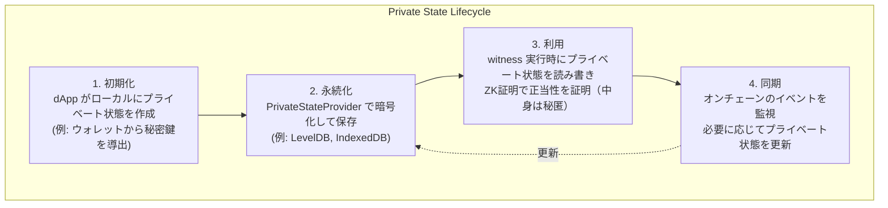

# Compact 言語ガイド

Compact は Midnight 専用のスマートコントラクト言語です。プライバシー保護を第一に設計されており、パブリック状態とプライベート計算を自然に記述できます。

## 言語の特徴

| 特徴 | Compact | Solidity | Rust (Anchor) |
|------|---------|----------|---------------|
| パラダイム | 宣言的 | 命令的 | 命令的 |
| 型システム | 静的 | 静的 | 静的 |
| プライバシー | ネイティブサポート | なし | なし |
| ZK回路生成 | 自動 | 不可 | 不可 |
| コンパイル先 | ZKIR + JS | EVM バイトコード | BPF |

## 基本構文

### Hello World: カウンターコントラクト

```compact
// counter.compact
pragma language_version >= 0.20;
import CompactStandardLibrary;

// オンチェーン状態（すべての参加者に公開）
ledger {
  count: Uint<128>;
}

// カウントを1増やす
export circuit increment(): [] {
  ledger.count = ledger.count + 1;
}

// カウントを1減らす
export circuit decrement(): [] {
  assert ledger.count > 0;
  ledger.count = ledger.count - 1;
}

// 現在のカウントを取得
export circuit get_count(): Uint<128> {
  return ledger.count;
}

// 指定した値を加算
export circuit add(value: Uint<128>): [] {
  ledger.count = ledger.count + value;
}
```

### 構文要素の解説

#### pragma

バージョン指定。互換性のために重要です。

```compact
pragma language_version >= 0.20;
import CompactStandardLibrary;
```

#### ledger ブロック

**パブリック状態**を定義します。オンチェーンに保存され、誰でも読むことができます。

```compact
ledger {
  // 単純な値
  counter: Uint<128>;
  
  // マッピング
  balances: Map<Bytes<32>, Uint<128>>;
  
  // オプション値
  owner: Maybe<Bytes<32>>;
}
```

**EVM との対比:**
```solidity
// Solidity の storage 変数に相当
contract Counter {
    uint256 public counter;           // ledger { counter: ... }
    mapping(address => uint256) balances; // Map<Bytes<32>, Uint<128>>
}
```

#### circuit

コントラクトの関数を定義します。`export` をつけると外部から呼び出し可能になります。

```compact
// 外部から呼び出し可能
export circuit public_function(): [] {
  // ...
}

// 内部のみ（他のcircuitから呼び出し可能）
circuit internal_helper(): Uint<128> {
  return 42;
}
```

**EVM との対比:**
```solidity
// Solidity の関数に相当
function publicFunction() public { ... }  // export circuit
function _internalHelper() internal { ... } // circuit (no export)
```

## データ型

### プリミティブ型

| Compact | 説明 | Solidity相当 |
|---------|------|-------------|
| `Uint<N>` | N ビットの符号なし整数 | `uint256` |
| `Integer` | 符号付き整数 | `int256` |
| `Boolean` | 真偽値 | `bool` |
| `Bytes<N>` | 固定長バイト列 | `bytesN` |
| `Field` | 有限体要素 | なし（ZK特有） |

### 複合型

```compact
// マッピング
balances: Map<Bytes<32>, Uint<128>>;

// オプション
maybe_value: Maybe<Uint<128>>;

// タプル
pair: (Uint<128>, Bytes<32>);

// 配列
items: Vector<4, Uint<128>>;
```

### 構造体

```compact
// 構造体定義
struct User {
  address: Bytes<32>;
  balance: Uint<128>;
  is_active: Boolean;
}

ledger {
  users: Map<Bytes<32>, User>;
}
```

## プライバシー: witness

### witness とは

`witness` は**プライベートな計算**を定義します。これが Midnight の核心機能です。

```compact
// プライベート状態を扱う witness を宣言
witness get_my_secret_balance(address: Bytes<32>): Uint<128>;

export circuit prove_sufficient_balance(
  required: Uint<128>
): Boolean {
  // witness を呼び出し（プライベート計算）
  let my_balance = get_my_secret_balance(/* caller's address */);
  
  // 結果だけを返す（残高自体は秘匿）
  return my_balance >= required;
}
```

### witness の実装（TypeScript側）

`witness` は Compact ファイルで宣言され、TypeScript で実装します：

```typescript
// witnesses.ts
import { type Witnesses } from './counter'; // compact compile が生成

type PrivateState = {
  myBalance: bigint;
  secretData: Uint8Array;
};

export const witnesses: Witnesses<PrivateState> = {
  get_my_secret_balance: (context) => (address: Uint8Array) => {
    // プライベート状態から値を取得
    return context.privateState.myBalance;
  },
  
  update_secret: (context) => (newValue: Uint8Array) => {
    // プライベート状態を更新
    context.privateState.secretData = newValue;
    return;
  }
};
```

### プライベート状態のライフサイクル



## 完全な例: プライベート投票

```compact
// voting.compact
pragma language_version >= 0.20;
import CompactStandardLibrary;

// パブリック状態
ledger {
  // 投票結果（集計のみ公開）
  yes_votes: Uint<128>;
  no_votes: Uint<128>;
  
  // 投票済みマーカー（アドレスをハッシュ化）
  voted: Map<Bytes<32>, Boolean>;
  
  // 投票期間
  voting_open: Boolean;
}

// プライベート計算
witness get_voter_credentials(): (Bytes<32>, Boolean);  // (voter_hash, vote)
witness record_vote(voter_hash: Bytes<32>, vote: Boolean): [];

export circuit cast_vote(): [] {
  assert ledger.voting_open;
  
  // プライベートに投票者情報と投票内容を取得
  let (voter_hash, vote) = get_voter_credentials();
  
  // 二重投票チェック
  assert !ledger.voted[voter_hash];
  
  // 投票をカウント（投票内容は秘匿、結果のみ反映）
  if vote {
    ledger.yes_votes = ledger.yes_votes + 1;
  } else {
    ledger.no_votes = ledger.no_votes + 1;
  }
  
  // 投票済みマーク
  ledger.voted[voter_hash] = true;
  
  // プライベート状態を更新
  record_vote(voter_hash, vote);
}

export circuit open_voting(): [] {
  ledger.voting_open = true;
}

export circuit close_voting(): [] {
  ledger.voting_open = false;
}
```

## コンパイルと出力

### コンパイルコマンド

```bash
compact compile voting.compact ./build
```

### 生成されるファイル

```
build/
├── contract/
│   ├── index.cjs       # コントラクトランタイム
│   └── index.d.cts     # TypeScript 型定義
├── zkir/
│   └── *.zkir          # ZK中間表現
└── keys/
    ├── *.prover        # 証明生成キー
    └── *.verifier      # 証明検証キー
```

### 生成される型定義（例）

```typescript
// voting.d.ts (自動生成)
export interface Contract {
  circuits: {
    cast_vote: () => Promise<void>;
    open_voting: () => Promise<void>;
    close_voting: () => Promise<void>;
  };
}

export interface Witnesses<PS> {
  get_voter_credentials: (ctx: WitnessContext<PS>) => () => [Uint8Array, boolean];
  record_vote: (ctx: WitnessContext<PS>) => (voter_hash: Uint8Array, vote: boolean) => void;
}

export interface Ledger {
  yes_votes: bigint;
  no_votes: bigint;
  voted: Map<Uint8Array, boolean>;
  voting_open: boolean;
}
```

## Solidity からの移行ガイド

### パターン対応表

| Solidity パターン | Compact パターン |
|------------------|-----------------|
| `msg.sender` | `witness` で caller 情報を取得 |
| `require(...)` | `assert ...` |
| `modifier` | 共通ロジックを circuit に分離 |
| `event` | `log(...)` 関数 |
| `payable` | Zswap Effects で処理 |

### アクセス制御

**Solidity:**
```solidity
modifier onlyOwner() {
    require(msg.sender == owner, "Not owner");
    _;
}
```

**Compact:**
```compact
witness get_caller_hash(): Bytes<32>;

circuit check_owner(): [] {
  let caller = get_caller_hash();
  assert caller == ledger.owner;
}

export circuit admin_function(): [] {
  check_owner();
  // ... 管理者のみの処理
}
```

### トークン移転

**Solidity:**
```solidity
function transfer(address to, uint256 amount) public {
    balances[msg.sender] -= amount;
    balances[to] += amount;
}
```

**Compact + Effects (プライベート転送):**
```compact
// Effects を使った Zswap 連携でプライベート転送
// コントラクトは Effects を宣言し、
// トランザクション構築時に Zswap インプット/アウトプットを追加
```

## ベストプラクティス

### 1. プライベート状態の最小化

```compact
// ✗ 避ける: 不必要なプライベート化
witness get_public_data(): Uint<128>;

// ✓ 推奨: 必要な場合のみプライベートに
// パブリック状態は ledger で直接アクセス
export circuit read_public(): Uint<128> {
  return ledger.public_counter;
}
```

### 2. 証明サイズの最適化

```compact
// ✗ 避ける: 大きなループ
circuit process_all(): [] {
  for i in 0..1000 {
    // 証明生成が非常に遅くなる
  }
}

// ✓ 推奨: バッチ処理を分割
export circuit process_batch(start: Uint<128>, count: Uint<128>): [] {
  assert count <= 10;
  // 小さなバッチで処理
}
```

### 3. アサーションの活用

```compact
export circuit safe_divide(a: Uint<128>, b: Uint<128>): Uint<128> {
  // ゼロ除算防止
  assert b > 0;
  return a / b;
}
```

## 開発ツール

### エディタサポート

- **Zed**: [compact-zed](https://github.com/midnightntwrk/compact-zed) 拡張
- **VS Code**: tree-sitter ベースの構文ハイライト
- **tree-sitter**: [compact-tree-sitter](https://github.com/midnightntwrk/compact-tree-sitter)

### CLI ツール

```bash
# コンパイル
compact compile contract.compact ./build
```

---

**次章**: [04-sdk-development](./04-sdk-development.md) - midnight-js による dApp 開発
