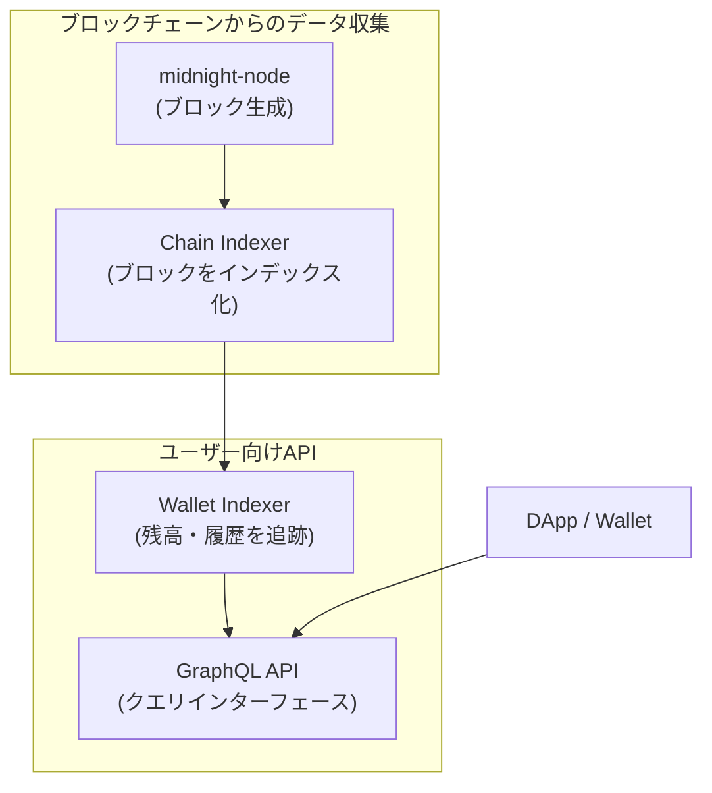
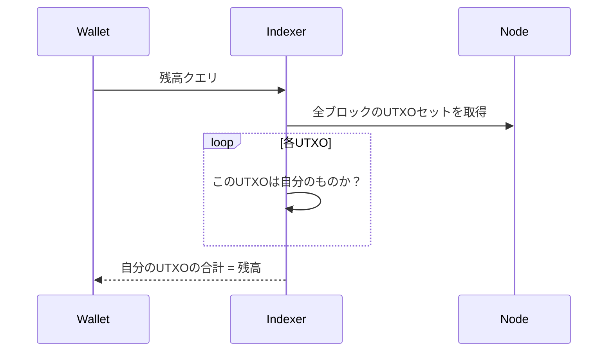
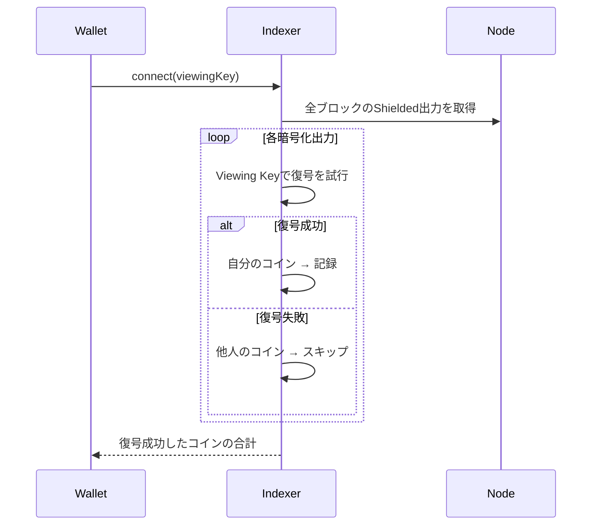
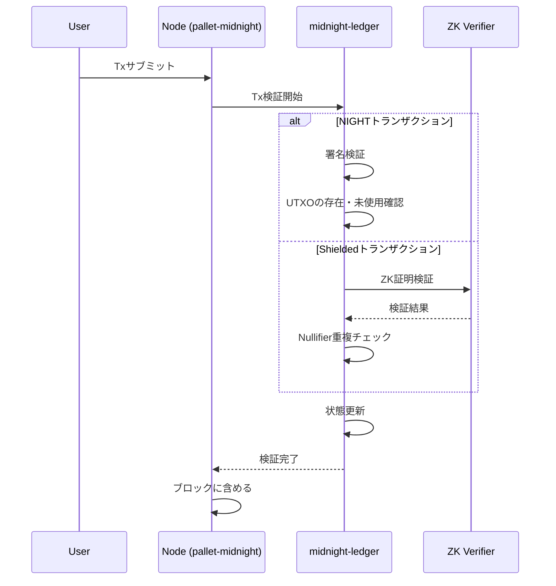
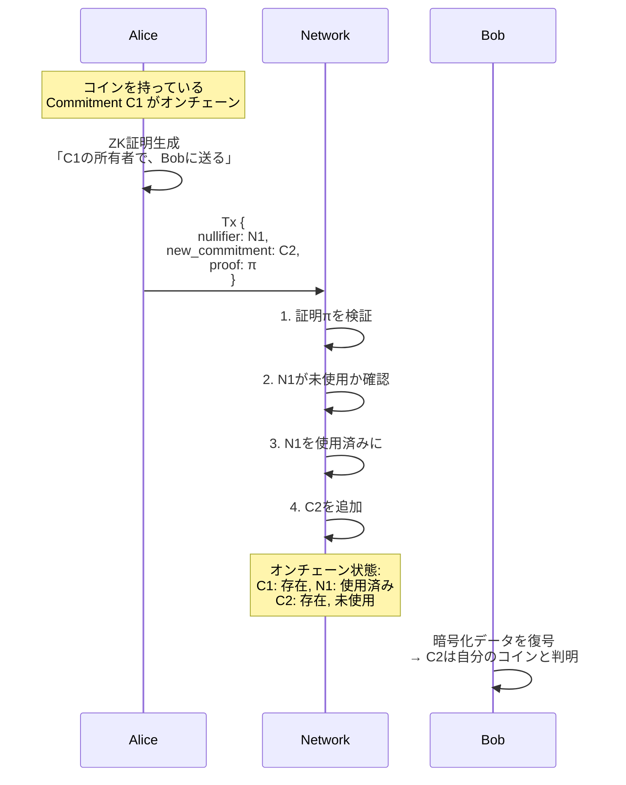

# Indexer と UTXO モデルの深掘り

この文書は Midnight の Indexer の役割と、Substrate ベースでありながら UTXO モデルを実現している仕組みを解説します。

## 目次

1. [midnight-indexerの役割](#midnight-indexerの役割)
2. [なぜUTXOにはIndexerが必要か](#なぜutxoにはindexerが必要か)
3. [SubstrateでUTXOを実現する仕組み](#substrateでutxoを実現する仕組み)
4. [Zswapの仕組み](#zswapの仕組み)

---

## midnight-indexerの役割

### 概要

midnight-indexer は Midnight ブロックチェーンのデータを効率的に検索・取得するためのコンポーネントです。



### 構成要素

| コンポーネント | 役割 |
|--------------|------|
| **Chain Indexer** | ブロックをスキャンし、トランザクション・イベントをデータベース化 |
| **Wallet Indexer** | ユーザーの残高・取引履歴を追跡（Viewing Keyを使用） |
| **GraphQL API** | DAppやウォレットからのクエリを処理 |

### 設定例

```toml
# 外部Nodeに接続する場合
[infra.node]
url = "wss://public-node.example.com"

# 自分のNodeに接続する場合  
[infra.node]
url = "ws://localhost:9944"
```

---

## なぜUTXOにはIndexerが必要か

### Account vs UTXO モデル

```
【Account モデル】(Ethereum, Polkadot)
┌───────────────────────────────────────────────────────────────────┐
│  アドレス              残高                                        │
│  0xAlice              100 ETH                                     │
│  0xBob                50 ETH                                      │
│                                                                    │
│  → アドレスを知っていれば、残高を直接参照可能                      │
└───────────────────────────────────────────────────────────────────┘

【UTXO モデル】(Bitcoin, Midnight Shielded)
┌───────────────────────────────────────────────────────────────────┐
│  UTXO1: Alice, 30 BTC, txid=abc...                                │
│  UTXO2: Alice, 25 BTC, txid=def...                                │
│  UTXO3: Bob, 50 BTC, txid=ghi...                                  │
│  UTXO4: Alice, 45 BTC, txid=jkl...                                │
│                                                                    │
│  Aliceの残高 = UTXO1 + UTXO2 + UTXO4 = 100 BTC                    │
│  → 全UTXOをスキャンして集計が必要                                  │
└───────────────────────────────────────────────────────────────────┘
```

### UTXOでは「スキャン」が必要



### Shielded UTXOの場合（さらに複雑）

```
通常UTXO:
  UTXO { owner: Alice, value: 100 }
  → ownerで判別可能

Shielded UTXO:
  UTXO { 
    commitment: 0x1234...,  ← 暗号化されたコイン情報
    encrypted_data: ...     ← 復号しないと中身不明
  }
  → Viewing Key で復号して初めて自分のものかわかる
```



---

## SubstrateでUTXOを実現する仕組み

### Polkadot はAccount モデル

| チェーン | モデル | 例 |
|---------|-------|-----|
| Polkadot | Account | Ethereum同様、アドレスに残高が紐付く |
| Bitcoin | UTXO | 個々のコインを追跡 |
| Midnight | **ハイブリッド** | Account (NIGHT) + UTXO (Shielded) |

### Substrate の柔軟性

Substrate は FRAME Pallet というモジュラー設計により、任意の状態機械を実装できます。

```
┌─────────────────────────────────────────────────────────────────┐
│                       Substrate Runtime                         │
├─────────────────────────────────────────────────────────────────┤
│                                                                  │
│   pallet-balances   pallet-staking   ...   pallet-midnight     │
│   (Account残高)     (ステーキング)         (カスタム)           │
│                                                                  │
│   ↓ 標準的なPalletを置き換え可能                                │
│                                                                  │
│   pallet-midnight 内で独自のUTXOモデルを実装                    │
│                                                                  │
└─────────────────────────────────────────────────────────────────┘
```

### pallet-midnight の構造

```rust
// midnight-node/node/src/service.rs より概念的に

pub struct MidnightPallet {
    // 標準Substrateのbalancesは使わない
    // 独自のledger実装を使用
    ledger: MidnightLedger,
}

impl MidnightLedger {
    // NIGHTトークン (Unshielded UTXO)
    night_utxos: BTreeMap<UtxoId, NightUtxo>,
    
    // Shielded Tokens (Zswap UTXO)
    coin_commitments: HashSet<CoinCommitment>,
    spent_nullifiers: HashSet<CoinNullifier>,
    
    // DUST (特殊な生成型UTXO)
    dust_utxos: BTreeMap<UtxoId, DustOutput>,
}
```

### トランザクション処理の流れ



---

## Zswapの仕組み

### Zerocash ベースの設計

Zswap は Zcash の Zerocash プロトコルを基に、atomic swap 機能を追加したものです。

```
Zerocash コアコンセプト:
┌──────────────────────────────────────────────────────────────────┐
│                                                                   │
│  コイン = (value, owner, salt)                                   │
│                                                                   │
│  Commitment = Hash(value, owner, salt)  ← 公開される              │
│  Nullifier = Hash(salt, secret_key)     ← 使用時に公開            │
│                                                                   │
│  ・Commitmentからはvalue/ownerが分からない                        │
│  ・NullifierからはどのCommitmentかが分からない                    │
│  ・同じNullifierは2回使えない（二重使用防止）                     │
│                                                                   │
└──────────────────────────────────────────────────────────────────┘
```

### CoinInfo 構造

```rust
// midnight-ledger/spec/zswap.md より

struct CoinInfo {
    token_type: TokenType,           // トークンの種類
    value: u64,                       // 金額
    owner_address: CompactPublicKey,  // 所有者
    encryption_public_key: X25519PublicKey,
    salt: Scalar,                     // ランダム値
}

// Commitment生成
fn coin_commitment(coin: &CoinInfo) -> CoinCommitment {
    Hash::pedersen_hash([
        coin.token_type,
        coin.value,
        coin.owner_address,
        coin.salt,
    ])
}

// Nullifier生成（使用時）
fn coin_nullifier(coin: &CoinInfo, secret_key: &SecretKey) -> CoinNullifier {
    Hash::poseidon_hash([coin.salt, secret_key])
}
```

### Shielded送金の流れ



### なぜ外部から追跡できないか

```
【公開情報】
・Commitment: 0x1234abcd...（何のコインか不明）
・Nullifier: 0x5678efgh...（どのコインを使ったか不明）

【隠されている情報】
・金額
・送信者
・受信者
・どのCommitmentがどのNullifierに対応するか

→ Viewing Key がないと、コインの中身も所有者も分からない
```

### Atomic Swap 機能

Zswap が Zerocash と異なる最大のポイントは **Atomic Swap** のサポートです。

#### Zerocash vs Zswap

| 項目 | Zerocash (Zcash) | Zswap (Midnight) |
|------|------------------|------------------|
| 基本機能 | プライベート送金 | プライベート送金 |
| 複数トークン | 1種類 (ZEC) | 複数種類対応 |
| Atomic Swap | ❌ 不可 | ✅ 可能 |
| オーダーブック | 外部に依存 | オンチェーンで可能 |

#### Offer 構造

Zswap のトランザクションは `ZswapOffer` という構造で、複数の inputs/outputs を持てます。

```rust
struct ZswapOffer<P> {
    inputs:     Set<ZswapInput<P>>,     // 複数の入力コイン
    outputs:    Set<ZswapOutput<P>>,    // 複数の出力コイン
    transients: Set<ZswapTransient<P>>, // 同一Tx内で生成→消費
    deltas:     Map<RawTokenType, i128>, // トークンごとの差分（正負）
}
```

#### Atomic Swap の例

```
シナリオ:
  Alice: Token A を 100 持っている → Token B が欲しい
  Bob:   Token B を 50 持っている  → Token A が欲しい
```

```
【Alice の Offer】
┌────────────────────────────────────────────────┐
│  inputs:  Token A, 100 (Alice が所有)          │
│  outputs: Token B, 50  (Alice 宛て)  ← 欲しい  │
│  deltas:  Token A: -100, Token B: +50          │
│           「A を 100 出して、B を 50 欲しい」   │
└────────────────────────────────────────────────┘

【Bob の Offer】
┌────────────────────────────────────────────────────┐
│  inputs:  Token B, 50  (Bob が所有)                │
│  outputs: Token A, 100 (Bob 宛て)      ← 欲しい   │
│  deltas:  Token B: -50, Token A: +100              │
│           「B を 50 出して、A を 100 欲しい」       │
└────────────────────────────────────────────────────┘
```

#### Offer のマージ

2つの Offer をマージして1つのトランザクションにできます。

```rust
impl<P> ZswapOffer<P> {
    fn merge(self, other: ZswapOffer<P>) -> Result<Self> {
        // 重複がないことを確認
        assert!(self.inputs.disjoint(other.inputs));
        assert!(self.outputs.disjoint(other.outputs));
        
        ZswapOffer {
            inputs: self.inputs + other.inputs,       // 合体
            outputs: self.outputs + other.outputs,    // 合体
            deltas: self.deltas + other.deltas,       // 差分を足す
        }
    }
}
```

```
【マージ結果】
┌──────────────────────────────────────────────────────────┐
│  合体した Offer:                                         │
│                                                          │
│  inputs:  Token A, 100 (Alice)                          │
│           Token B, 50  (Bob)                            │
│                                                          │
│  outputs: Token B, 50  (→Alice)                         │
│           Token A, 100 (→Bob)                           │
│                                                          │
│  deltas:  Token A: -100 + 100 = 0  ✓ バランス           │
│           Token B: -50 + 50 = 0    ✓ バランス           │
│                                                          │
│  → 1つのトランザクションとして成功 or 失敗              │
└──────────────────────────────────────────────────────────┘
```

#### なぜ "Atomic" か

```
┌─────────────────────────────────────────────────────────────────────┐
│                        Atomicity の保証                             │
├─────────────────────────────────────────────────────────────────────┤
│                                                                      │
│  マージされた Offer が有効になる条件:                               │
│                                                                      │
│  1. すべての deltas がゼロ（バランス）                              │
│  2. すべての input の ZK 証明が有効                                 │
│  3. すべての output の ZK 証明が有効                                │
│                                                                      │
│  → どれか1つでも失敗すれば、全体が失敗                              │
│  → 「Alice だけ送って Bob は送らない」は不可能                      │
│                                                                      │
└─────────────────────────────────────────────────────────────────────┘
```

#### Zerocash との違いまとめ

```
【Zerocash（従来）】
Tx1: Alice → Bob: 100 Token A
Tx2: Bob → Alice: 50 Token B

問題:
- Tx1 が通った後、Bob が Tx2 を送らないかもしれない
- 「信頼」が必要

【Zswap（Atomic）】
Tx: Alice の Offer + Bob の Offer（マージ）

保証:
- 両方成功するか、両方失敗するか
- 「信頼不要」な P2P トークン交換
```

これにより、DEX のような機能をプライバシー保護しながらオンチェーンで実現できます。

---

## まとめ

### Indexerの必要性

| 用途 | Indexer | 理由 |
|------|---------|------|
| NIGHT残高確認 | 不要 | アドレスで直接クエリ可能 |
| DUST残高確認 | 必要 | Shielded、Viewing Key必要 |
| Shielded残高 | 必要 | 暗号化データの復号が必要 |
| トランザクション履歴 | 必要 | 効率的な検索のため |

### Substrate でUTXO を実現

- Substrate の FRAME Pallet 機構で柔軟にカスタマイズ
- `pallet-midnight` が標準の `pallet-balances` を置き換え
- `midnight-ledger` で独自の UTXO + ZK 検証ロジックを実装

### Zswap のプライバシー保証

- Commitment: コインの存在証明（中身は秘密）
- Nullifier: コインの使用証明（どれを使ったかは秘密）
- ZK証明: 正当性を証明しながらデータを秘匿

