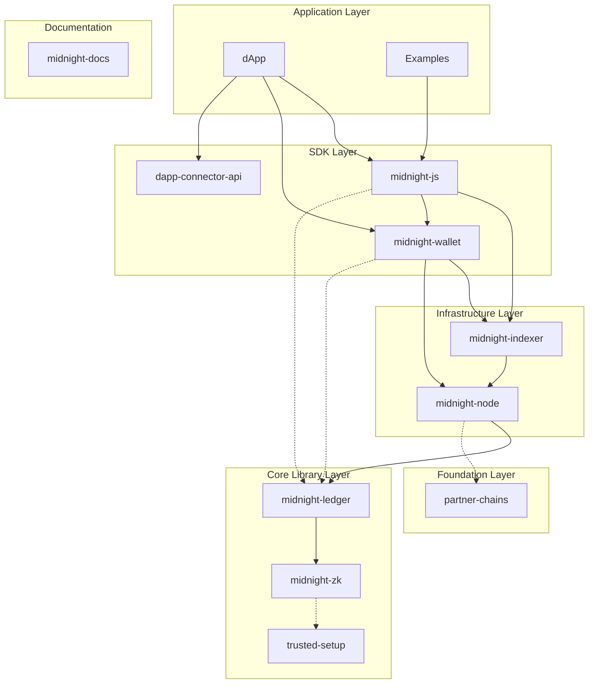

# Submodules Overview

Midnight ブロックチェーンを構成する各コンポーネントのサブモジュール一覧です。

## アーキテクチャ

**凡例:**
- 実線 → 直接的な依存・通信
- 点線 → ライブラリ依存（WASM バインディング等）

## リポジトリ概要

### コアコンポーネント

| リポジトリ | 言語 | 概要 |
|-----------|------|------|
| [midnight-node](#midnight-node) | Rust | ブロックチェーンノード実装 |
| [midnight-ledger](#midnight-ledger) | Rust | 台帳・トランザクション処理 |
| [midnight-zk](#midnight-zk) | Rust | ゼロ知識証明システム |
| [midnight-indexer](#midnight-indexer) | Rust | ブロックチェーンインデクサー |
| [midnight-wallet](#midnight-wallet) | TypeScript | ウォレットSDK |
| [midnight-js](#midnight-js) | TypeScript | dApp開発フレームワーク |
| [partner-chains](#partner-chains) | Rust | Cardano Partner Chain ノード |

### 追加リソース

| リポジトリ | 言語 | 概要 |
|-----------|------|------|
| [midnight-docs](#midnight-docs) | MDX | 公式ドキュメント |
| [example-counter](#example-counter) | TypeScript | カウンターサンプル |
| [example-bboard](#example-bboard) | TypeScript | 掲示板サンプル (React UI) |
| [midnight-dapp-connector-api](#midnight-dapp-connector-api) | TypeScript | dApp コネクタ API |
| [midnight-trusted-setup](#midnight-trusted-setup) | Rust | Trusted Setup セレモニー |

---

## midnight-node

Midnight ブロックチェーンのコアノード実装。コンセンサス、トランザクション処理、プライバシー保護スマートコントラクト実行を提供する。Substrate ベースで構築されており、Cardano をメインチェーンとする Partner Chain として動作する。

**主要機能:**
- ゼロ知識証明によるプライバシー保護スマートコントラクト
- AURA（ブロック生成）+ GRANDPA（ファイナリティ）ハイブリッドコンセンサス
- WebSocket RPC (9944) / P2P (30333)

---

## midnight-ledger

Midnight の台帳実装。トランザクション構造、状態管理、Rust/WASM TypeScript API を提供する。ゼロ知識証明の検証やスマートコントラクトランタイムも含む。

**主要コンポーネント:**
- `ledger` - トランザクション処理のメイン実装
- `zswap` - アトミックスワップ対応シールドトークン
- `zkir` - ゼロ知識IR・回路コンパイラ
- `onchain-runtime` / `onchain-vm` - コントラクトランタイム・VM

---

## midnight-zk

Midnight で使用されるゼロ知識証明システムとZK回路構築ツール。

**主要コンポーネント:**
- `curves` - BLS12-381 / JubJub 楕円曲線実装
- `proof-system` - KZGコミットメントを使用したPlonk証明システム
- `circuits` - ZK回路構築ツール
- `aggregator` - 証明集約ツールキット

---

## midnight-indexer

ブロックチェーンデータを効率的にインデックス化し、GraphQL API で提供するインデクサー。ウォレット向けのリアルタイム通知も提供する。

**主要コンポーネント:**
- Chain Indexer - ノードからブロック取得・保存
- Wallet Indexer - ウォレット関連トランザクションの追跡
- Indexer API - GraphQL クエリ/サブスクリプション

**デプロイモード:** Standalone (SQLite) / Cloud (PostgreSQL + NATS)

---

## midnight-wallet

Midnight ウォレット仕様の実装。鍵・アドレス生成、トランザクション構築・送信、ステート同期などの機能を提供する。

**主要コンポーネント:**
- `wallet` - ウォレットランタイム・ビルダー
- `hd` - HDウォレットAPI実装
- `address-format` - Bech32m フォーマット実装
- `capabilities` - コイン選択・残高管理

---

## midnight-js

Midnight ブロックチェーン向けの TypeScript dApp 開発フレームワーク。Web3.js (Ethereum) や polkadot.js (Polkadot) に相当する。

**主要機能:**
- トランザクション作成・送信
- ウォレット連携
- ブロック/コントラクト状態のクエリ
- チェーンイベントのサブスクリプション
- ローカルでのスマートコントラクト実行
- プライベートステートの管理
- ゼロ知識証明の生成・検証

---

## partner-chains

Cardano Partner Chain 向けの Substrate ベースノード。サイドチェーンの作成・管理を行い、Cardano エコシステムと統合する。

**主要機能:**
- バリデータ向けブロック生成報酬
- ネイティブトークン管理（Cardano との連携）
- パーミッションド/レジスタード バリデータ管理

---

## midnight-docs

Midnight の公式ドキュメントソース。MDX 形式で記述されており、https://docs.midnight.network/ で公開されている。

**内容:**
- Getting Started ガイド
- Compact 言語リファレンス
- SDK ドキュメント
- API リファレンス

---

## example-counter

シンプルなカウンターコントラクトのサンプルプロジェクト。Compact コントラクトと CLI 環境を提供する。

**学習ポイント:**
- 基本的な Compact 構文
- コントラクトのデプロイ
- circuit の呼び出し

---

## example-bboard

掲示板 dApp のサンプルプロジェクト。React UI 付きで、実践的な dApp 開発パターンを学べる。

**学習ポイント:**
- React との統合
- プライベート状態の管理
- リアルタイム更新

---

## midnight-dapp-connector-api

dApp とウォレットソフトウェア間の通信を可能にする API。データアクセスとセキュリティを制御しながら相互作用を実現する。

**主要機能:**
- ウォレット検出・接続
- トランザクション署名リクエスト
- アドレス取得

---

## midnight-trusted-setup

Plonk over BLS12-381 のための Trusted Setup セレモニー。ZK 証明システムに必要な共通参照文字列 (CRS) を生成する。

**内容:**
- Powers of Tau セレモニー
- 検証ツール
- パラメータファイル

---

## 関連リンク

- [Midnight Documentation](https://docs.midnight.network/)
- [Midnight Foundation](https://midnight.network/)
- [開発者ガイドブック](../docs/) - このリポジトリの詳細ガイド
